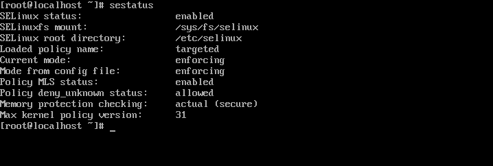
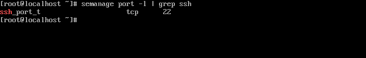
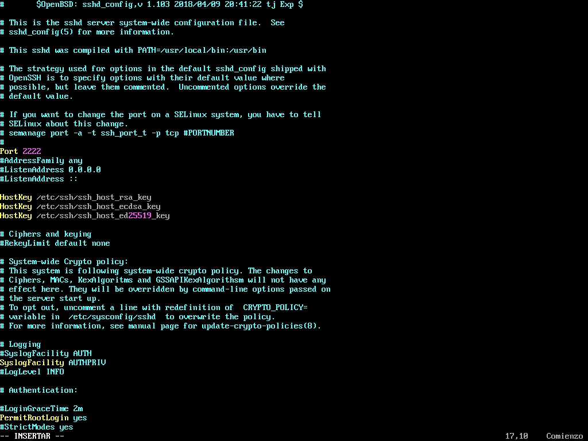
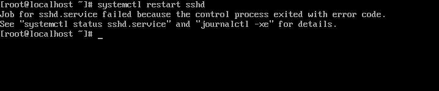
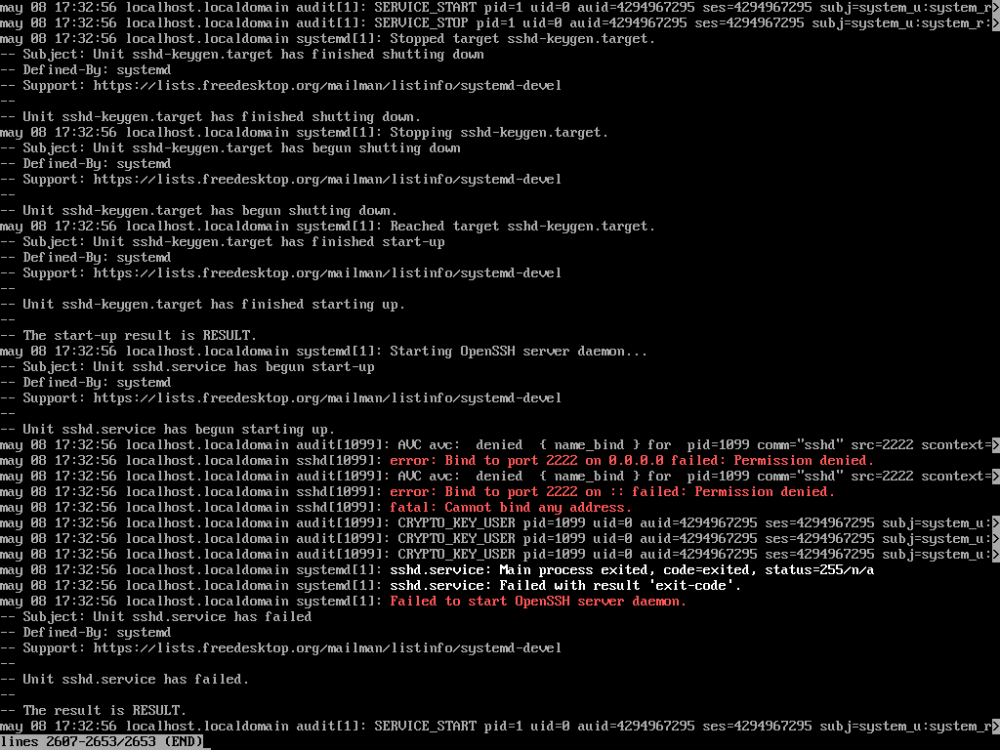
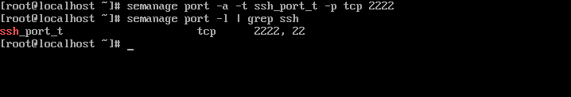
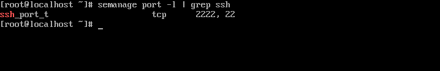
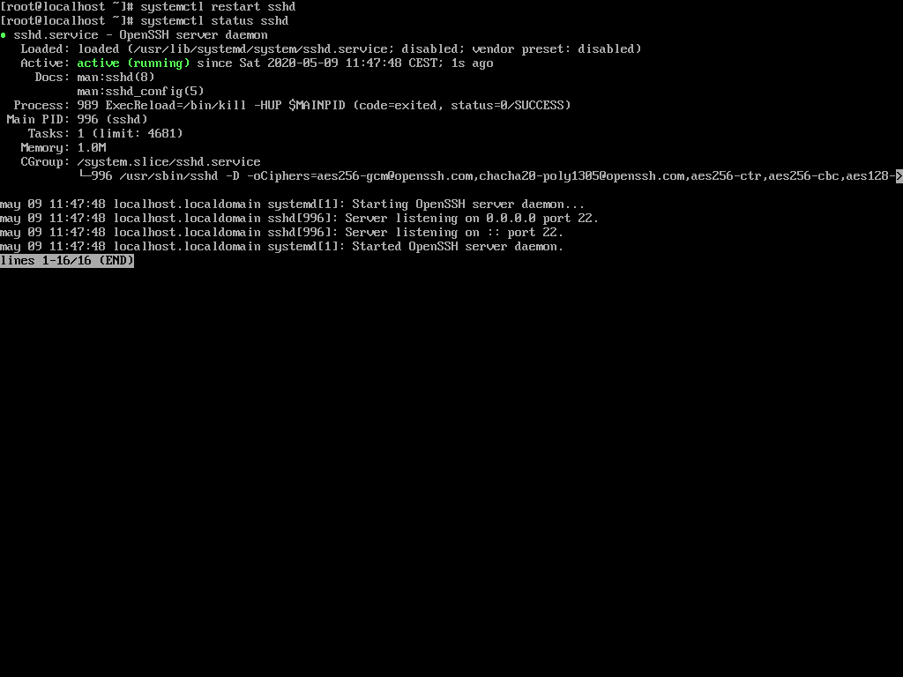

# EJEMPLO 1

- Objetivo: demostración del funcionamiento del modo de operación **Enforcing**

## Comprobaciones

**1. Comprobar en que modo de operación trabaja actualmente SELinux, en nuestro caso está en modo Enforcing**

**2. Buscamos el puerto en el que trabaja el servicio sshd**

**3. Modificamos el puerto sshd manualmente por el puerto 2222**

**4. Reiniciamos el servicio y vemos que no nos lo permite**

**5. Dejamos el fichero /etc/ssh/sshd_config como estaba**

**6. Modificaremos la política del puerto del servicio sshd y añadiremos el puerto 2222**

**7. Comprobamos que la política se ha añadido correctamente**

**8. Intentamos eliminar la politica del puerto 22 del servicio ssh y vemos que no nos permite eliminar una política ya definida por defecto**

**9. Reiniciamos el servicio y vemos que omite la política añadida. El servicio sshd sigue escuchando solo por el puerto 22**

**10. Intentamos acceder por el puerto 2222 desde nuestra máquina local hacia la máquina virtual para comprobar que el servicio no atiende por el puerto 2222**

