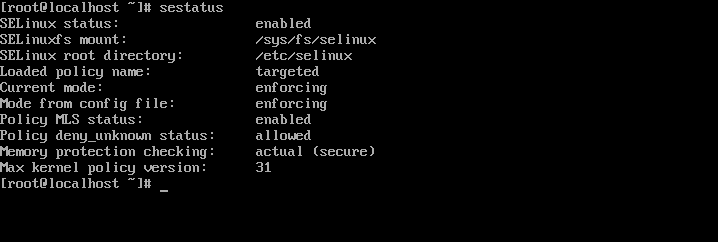
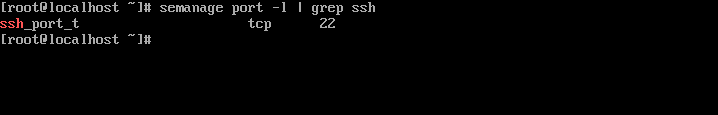
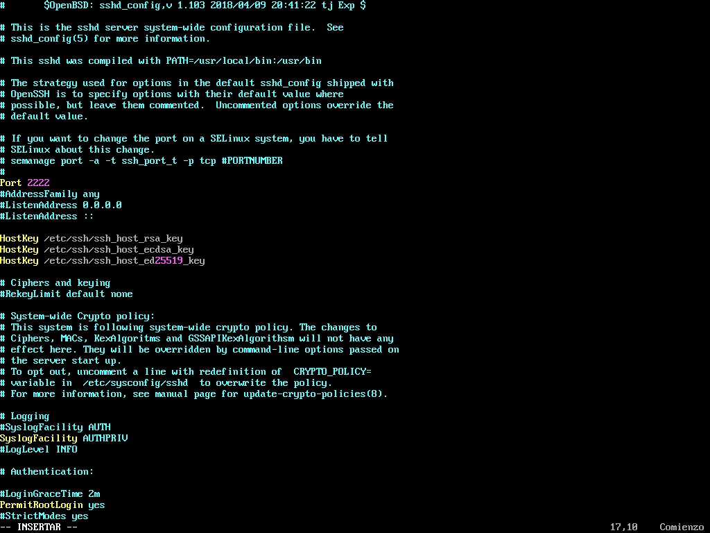
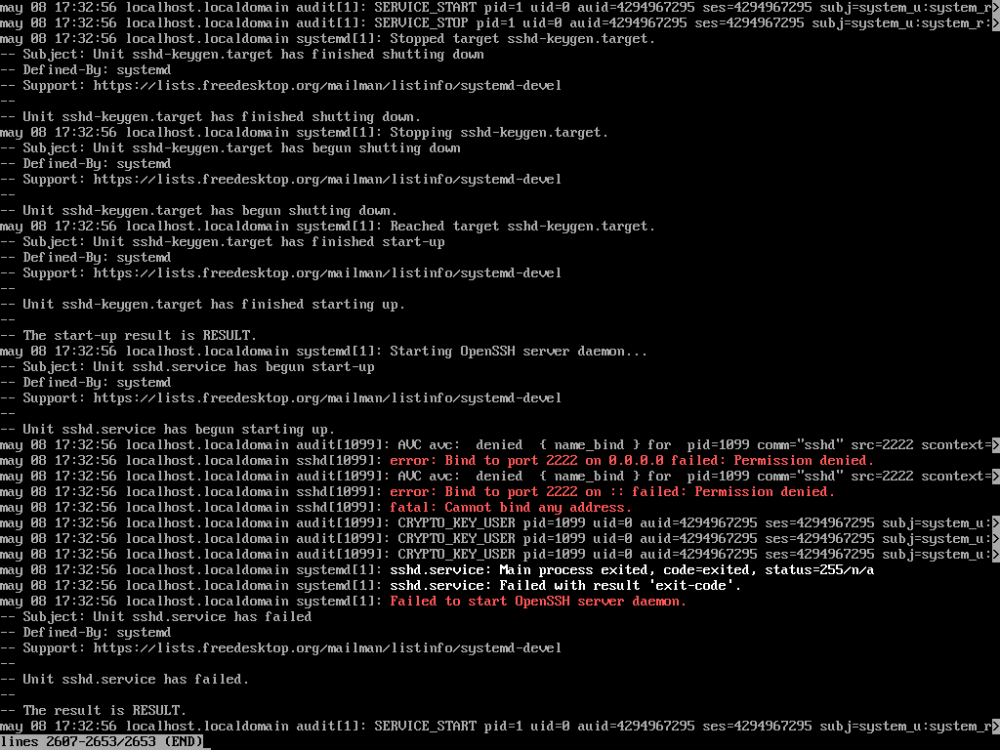
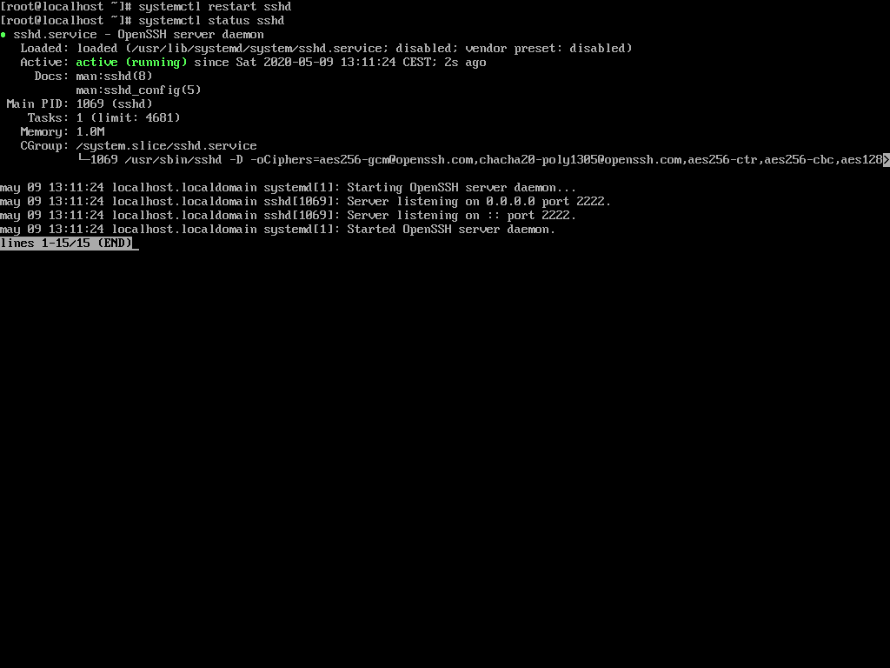
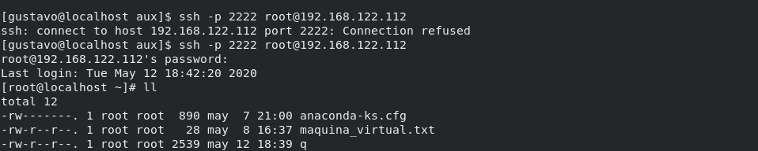

# EJEMPLO 1

- Objetivo: Demostración del funcionamiento del modo de operación **Enforcing** utilizando el servicio **SSHD** y la orden de gestión **semanage**, que se utilizará para crear una regla que permitirá el cambio del puerto del servicio.

## Explicación

El modo Enforcing de SELinux sigue a raja tabla las reglas definidas en el sistema, en el caso de que queramos realizar una acción que no se encuentra en ninguna regla, SELinux nos negará el acceso.

En este caso realizaré pruebas con el servicio SSHD. Existe una regla que dicta que el servicio escuche por el puerto 22, al modificar el puerto por el 2222 SELinux negará el acceso porque no existe una regla que dicte esto.  

Para permitir el acceso por el puerto 2222 crearé una regla con el comando semanage que lo permita i así podremos conectarnos remotamente por el puerto nuevo.

### Comprobaciones

**1. Verificar que SELinux está en modo de operación Enforcing**

**2. Buscar la regla del puerto en el que trabaja el servicio SSHD**

**3. Modificar el puerto del servicio manualmente por el puerto 2222 en el fichero de configuración del server /etc/ssh/sshd_config**

**4. Reiniciar el servicio y verificar que no lo permite porque la regla dicta que escuche solo por el puerto 22**

**5. Modificar la política del puerto y añado el puerto 2222. Verificar que se ha añadido correctamente la política**

**6. Reiniciar el servicio y verificar que ahora escucha por el puerto 2222**

**7. Conectarse a la máquina virtual por el puerto 2222**

