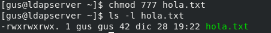
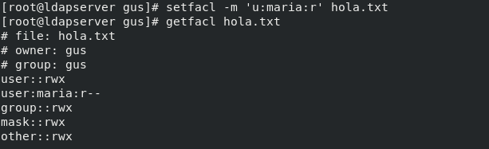
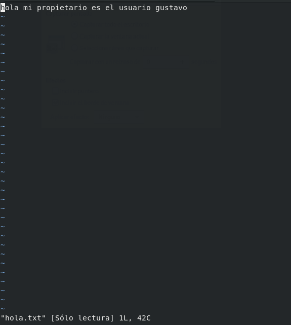
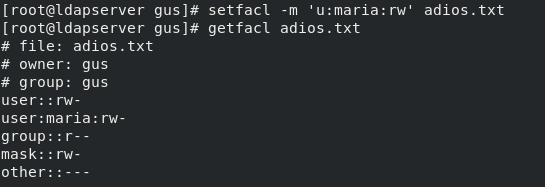
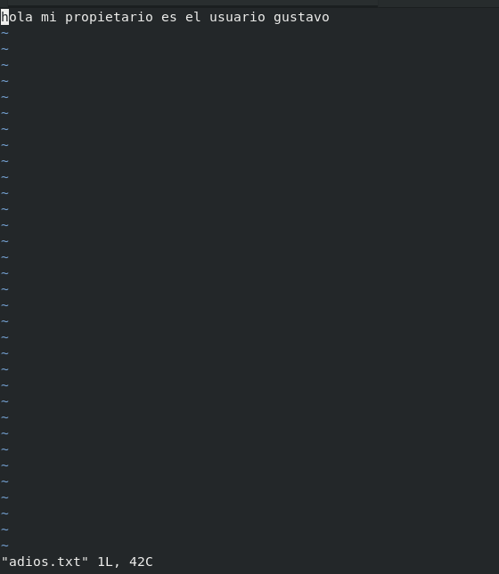
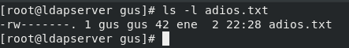
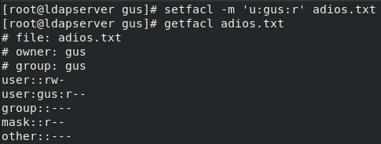
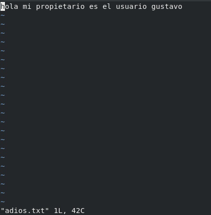

# EJEMPLO 10

- Objetivo: Demostrar el funcionamiento de las ACL's mediante sus ordenes de gestión: **getfacl** y **setfactl**.

## Explicación

En este ejemplo tenemos tres situaciones en las que las reglas DAC y MAC actúan de manera diferente dependiendo de los permisos y el sujeto que actua sobre un objeto.

Recordemos que las reglas DAC actúan primero, en caso de que estas permitan el acceso se mirarán posteriormente las MAC para ver si estas deniegan el acceso.

## Situación 1

1. Tenemos un archivo llamado hola.txt en el directorio home del usuario gus el cual es el propietario con los siguientes permisos:

2. Asignamos una ACL que solo permita al usuario maria leer el archivo.

3. Comprobamos que las ACL deniegan la escritura al usuario maria.

## Situación 2

1. Tenemos un archivo llamado adios.txt en el directorio home del usuario gus el cual es el propietario con los siguientes permisos:

2. Asignamos una ACL que permita al usuario maria leer y editar archivo.

3. Comprobamos que las ACL permiten la lectura y escritura al usuario maria.

**Si se añaden ACL permitiendo a un sujeto acceder a un objeto, aunque las reglas DAC digan lo contrario se permitirá el acceso**

## Situación 3

1. Tenemos un archivo llamado adios.txt en el directorio home del usuario gus el cual es el propietario con los siguientes permisos:

2. Asignamos un ACL que deniegue al propietario la edición del fichero.

3. Comprobamos que la ACL no tiene ningún efecto, ya que las ACL solo actúan contra usuarios que no son propietarios de ningún objeto al cual se aplica la ACL.

**Con este ejemplo se demuestra que las reglas DAC actúan antes que las reglas MAC**
