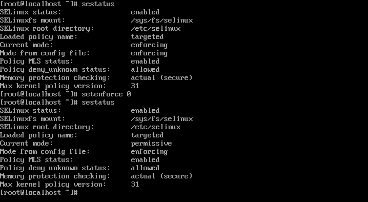
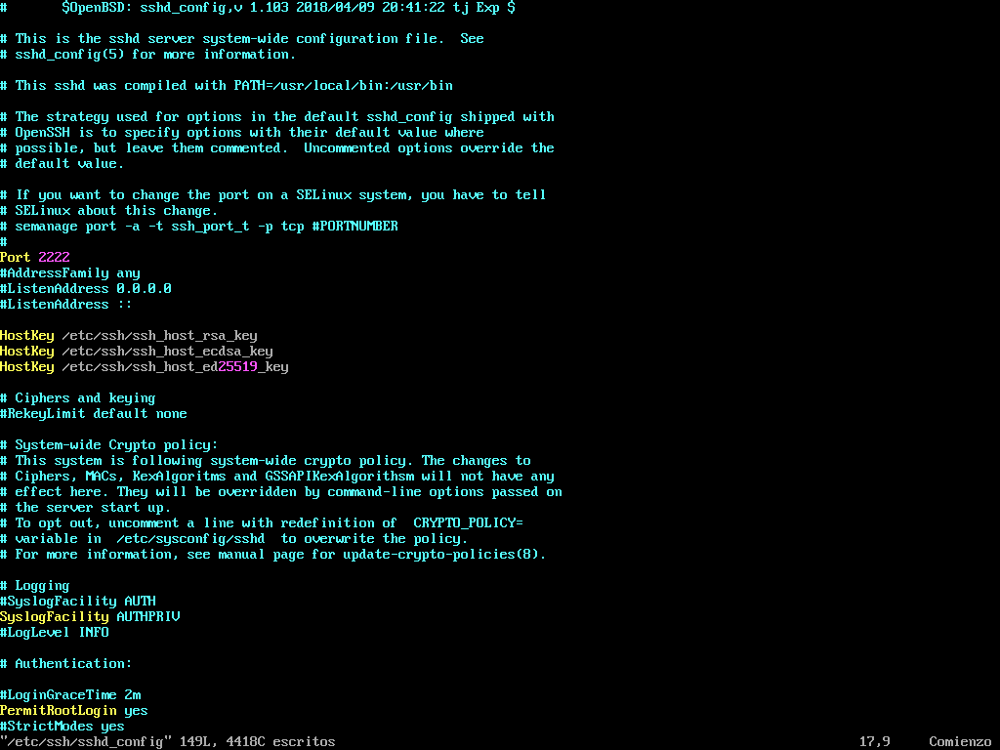
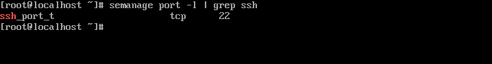
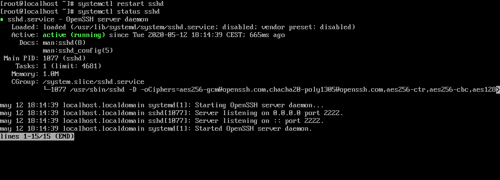
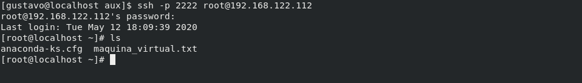

# COMPROBACIONES EJEMPLO 2

- Objetivo: demostración del funcionamiento del modo de operación **Permissive**

## Comprobaciones

**1. Cambiamos el modo de operación de SELinux de Enforcing a Permissive**

**2. Editamos manualmente el fichero /etc/ssh/sshd_config y cambiamos el puerto por el 2222**

**3. Verificamos que la regla del puerto del servicio ssh hace que escuche por el puerto 22**

**4. Reiniciamos el servicio sshd y verificamos que ahora escucha por el puerto 2222 y no por el 22 aunque así lo dicte la regla de SELinux**

**5. Nos conectamos de la maquina local a la maquina virtual por el puerto nuevo**

