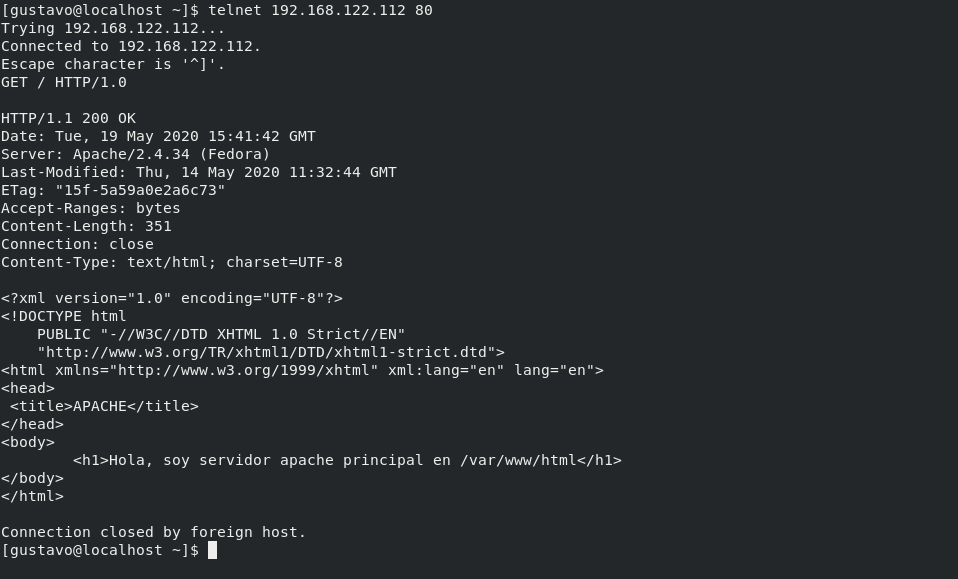

# EJEMPLO 3

- Objetivo: Mostrar los errores log del servidor **Apache HTTPD** y del sistema, y cambiar el directorio por defecto **/var/www/html** por uno propio en modo Enforcing.

## Explicación

Como en el ejemplo 1 mostraré los problemas que da el modo Enforcing a la hora de manipular servicios, en este caso usaremos el servicio **Apache HTTP**.

Además mostraremos los registros de log del servicio HTTPD de la carpeta **/var/log/httpd** y  los registros del sistema a través del servicio rsyslog que aloja a estos en el fichero **/var/log/messages**.

### COMPROBACIONES

**1. Verificar que SELinux está en modo Enforcing**

**2. Poner en marcha el servicio y crear un fichero index.html dentro de "/var/www/html". Conectar desde la máquina local a través de un telnet por el puerto 80 para verificar el acceso y que se puede ver el fichero**

**3. Crear la carpeta apache en el directorio home del usuario gus y dentro el fichero de configuración myconf.conf, que simulará al fichero de configuración real del servicio "/etc/httpd/conf/httpd.conf", pero con una configuración personalizada**

 
 

**4. Crear la carpeta "www/html" en el directorio home del usuario gus, que será la nueva carpeta por defecto del servicio apache y dentro el fichero index.html**

**5. Editar el fichero "/etc/httpd/conf/httpd.conf" y comentar la ultima linea del fichero, después, añadir "Include /home/gus/apache/myconf.conf" donde se cargará la configuración personalizada**

**6. Reiniciar el servicio httpd y comprobar que no lo permite, ya que si SELinux está en modo enforcing, solo puede leer directorios/archivos que tengan la etiqueta httpd_sys_content_t y directorios/archivos de configuración que tengan la etiqueta httpd_config_t, si no tienen estas etiquetas se negará el acceso automáticamente. Para confirmar esto, se mirará los archivos log del sistema y del propio servicio**

**7. Mirar la etiqueta de la carpeta por defecto del servicio "/var/www/html" y las de los archivos de configuración personalizados. Cambiar las etiquetas de los archivos personalizados por las etiquetas de los archivos del servicio.**

**8. Reiniciar el servicio y verificar que lo permite, ya que se le han asignado las etiquetas correctas. Comprobamos el acceso mediante una conexión a la máquina virtual a través de un telnet por el puerto 80**

