# EJEMPLO 3

- Objetivo: Mostrar los errores log del servidor apache y cambiar el directorio por defecto "/var/www/html" por uno propio en modo Enforcing.

### Explicación

Como en los ejemplos 1 y 2 mostraremos los problemas que da el modo Enforcing a la hora de manipular servicios, en este caso usaremos el servicio Apache HTTP.

Además mostraremos los registros de log del servicio HTTPD de la carpeta /var/log/httpd y de los registros del sistema a través del servicio rsyslog que aloja a estos en el fichero /var/log/messages

## COMPROBACIONES

**1.Verificamos que SELinux está en modo Enforcing**

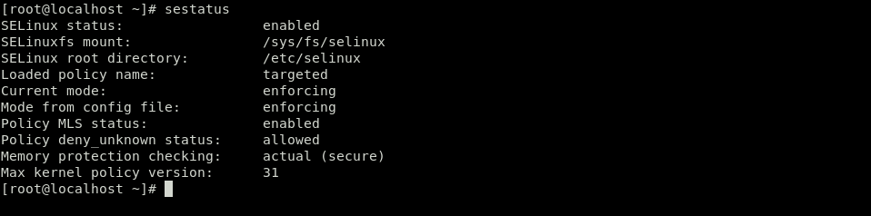

**2. Iniciamos el servicio httpd y creamos un fichero .html dentro de /var/www/html. Nos conectamos desde la máquina local a través de un telnet por el puerto 80 para verificar que tenemos acceso y que podemos ver el fichero**

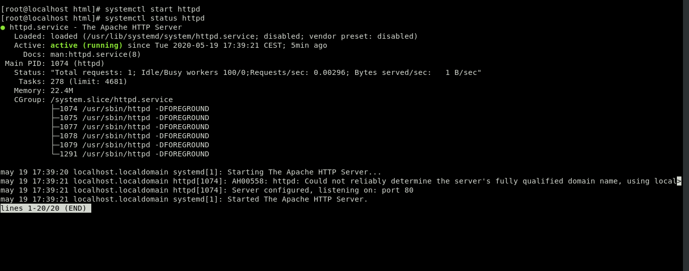
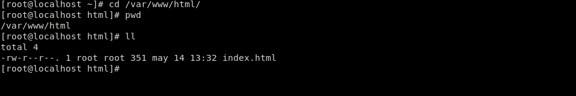
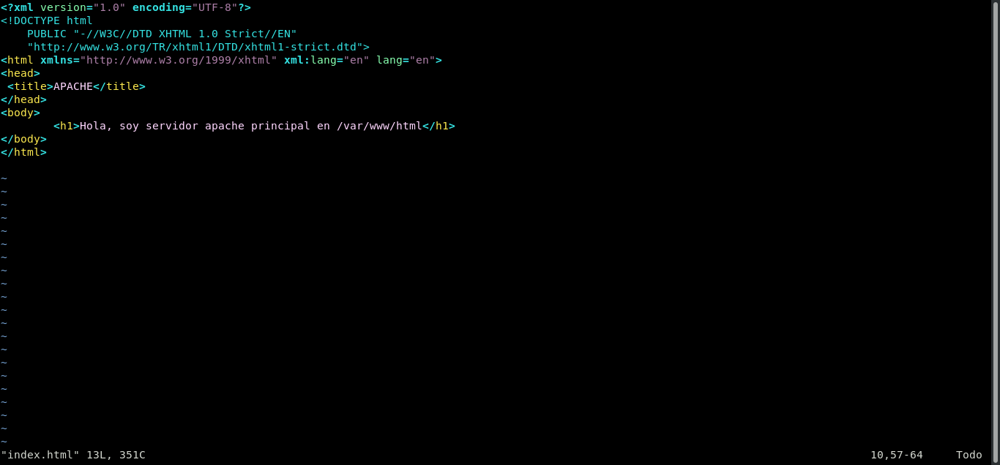

**3. Creamos la carpeta apache en el directorio home del usuario gus y dentro el fichero de configuracón myconf.conf, que simulará al fichero de configuración real del servicio apache /etc/httpd/conf/httpd.conf pero con la nuestra propia configuración**

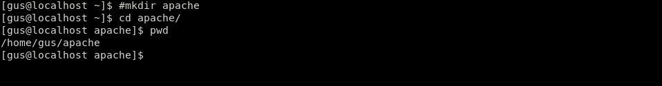 
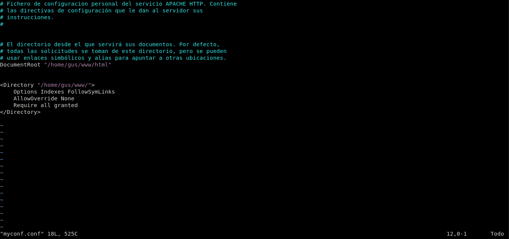 

**4. Creamos la carpeta /www/html en el directorio home del usuario gus, que será la nueva carpeta por defecto del servicio apache y dentro el fichero index.html**

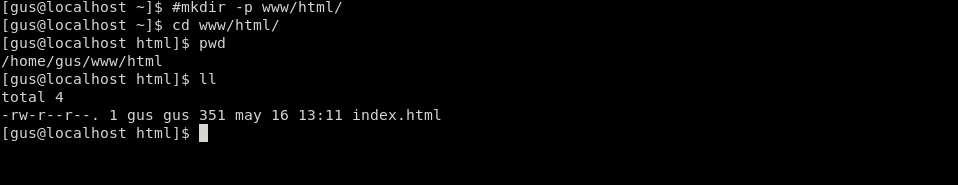
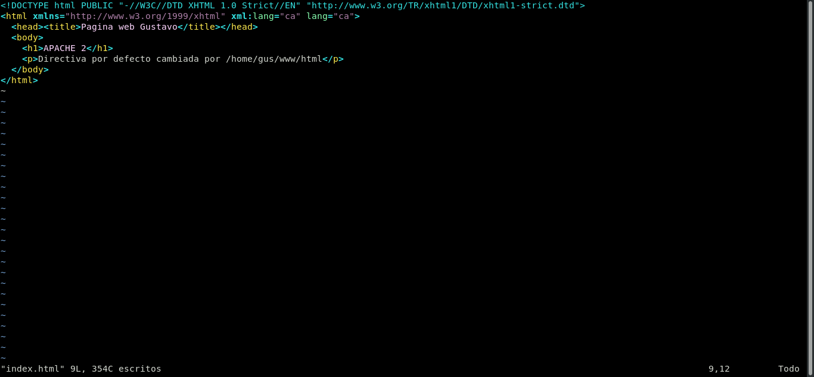

**5. Editamos el fichero /etc/httpd/conf/httpd.conf y comentamos la ultima linea del fichero, después, añadimos Include /home/gus/apache/myconf.conf donde cargaremos nuestra propia configuración**

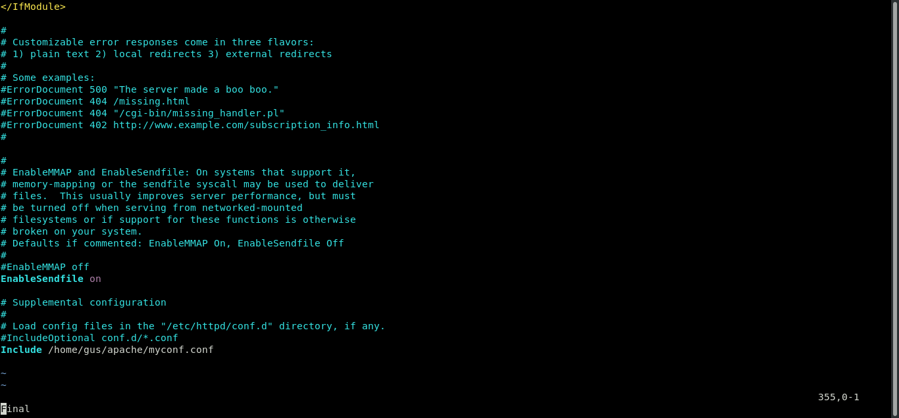

**6. Reiniciamos el servicio httpd y vemos que no nos lo permite ya que si SELinux está en modo enforcing, solo puede leer directorios/archivos que tengan la etiqueta httpd_sys_content_t y directorios/archivos de configuración que tengan la etiqueta httpd_config_t, si no tienen estas etiquetas se negará el acceso. Para confirmar esto, vemos los archivos log del sistema y del propio servicio**

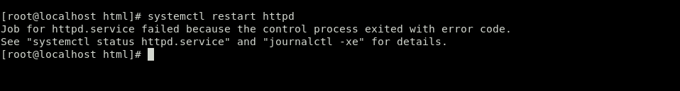
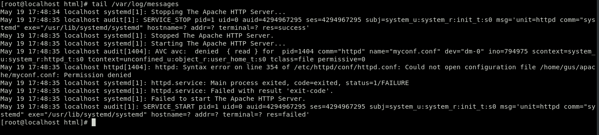

**7.Nos fijamos en la etiqueta de la carpeta por defecto del servicio httpd "/var/www/html" y en la del fichero de configuración para poder cambiar la etiqueta de nuestros archivos personalizados. Vemos que la etiqueta de nuestros archivos es user_home_t y por lo tanto nos negará el acceso, asñi que procederemos a cambiarlas por las del servicio httpd.**

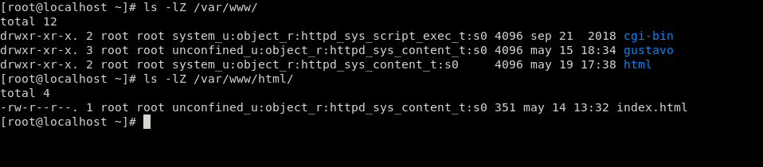
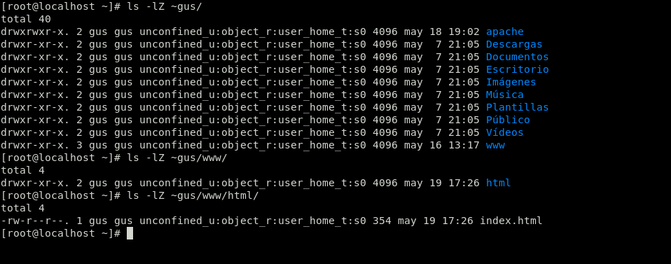
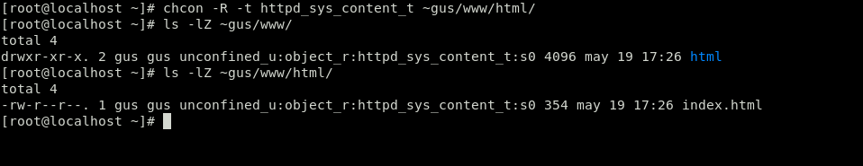
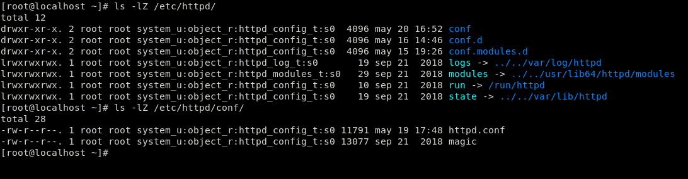
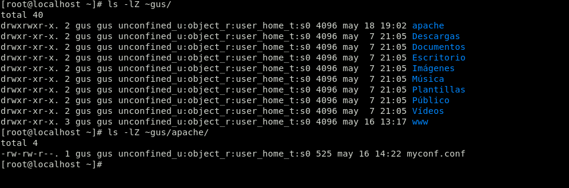
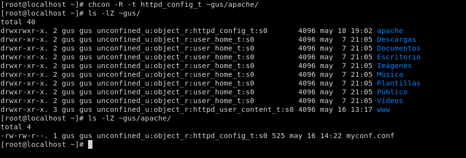

**8. Reiniciamos el servicio y vemos que nos lo permite ya que le hemos asignado las etiquetas correctas. Además, nos conectamos desde la máquina local a través de un telnet por el puerto 80 para verificar que vemos el archivo personalizado.**

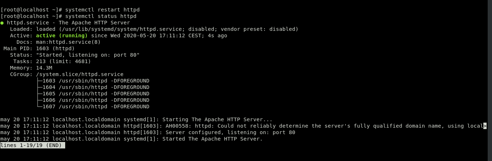
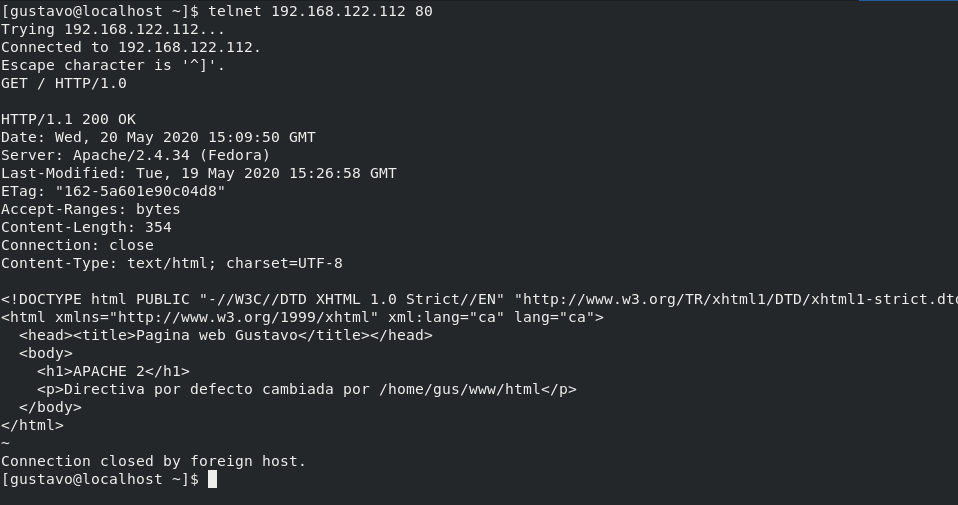

