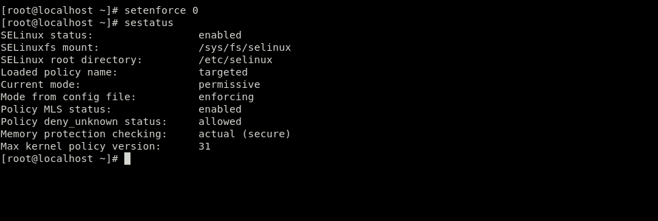
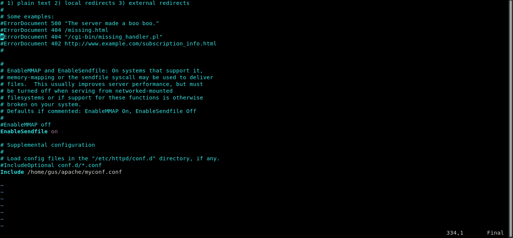
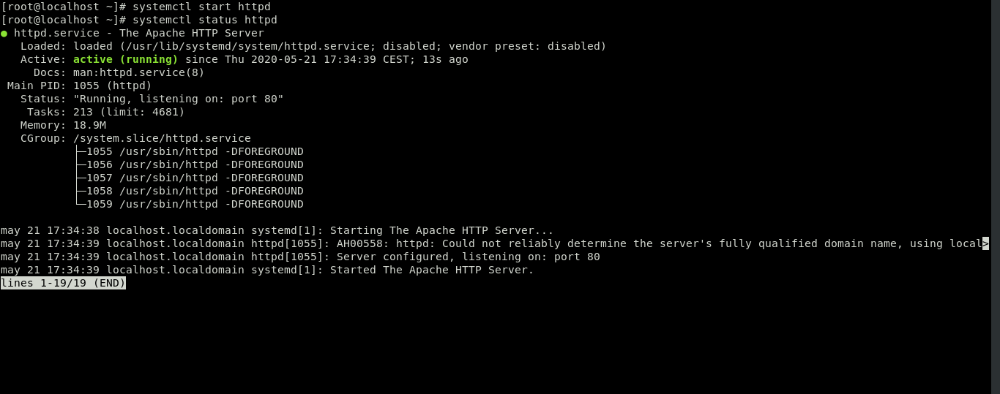
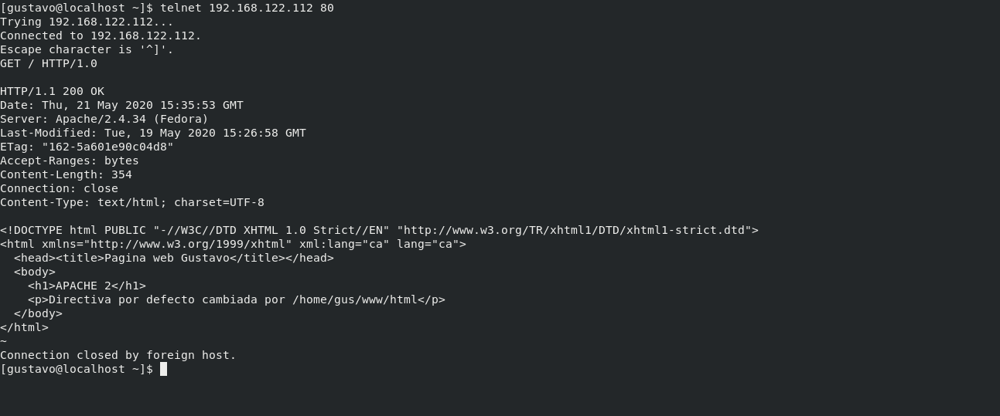
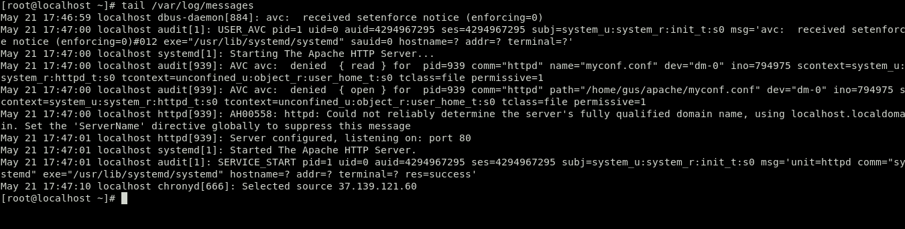

# EJEMPLO 4

- Objetivo: Mostrar los errores log del servidor apache y cambiar el directorio por defecto **/var/www/html** por uno propio en modo **Permissive**.

## Explicación

Como en el ejemplo 2 mostraremos como el modo Permissive solo registra las acciones denegadas pero las ejecuta igualmente a la hora de manipular servicios, en este caso usaremos el servicio **Apache HTTPD**.

Además mostraremos los registros de log del servicio en la carpeta **/var/log/httpd** y de los registros del sistema a través del servicio rsyslog que aloja a estos en el fichero **/var/log/messages**.

### Comprobaciones

**1. Cambiar el modo de operación de SELinux a Permissive**

**2. Comentar la ultima linea del fichero /etc/httpd/conf/httpd.conf y añadir "Include /home/gus/apache/myconf.conf"**

**3. Encender el servicio apache y verificar que lo permite ya que el modo Permissive no realiza ninguna acción de negación**

**4. Conectarse a la máquina virtual a través de un telnet por el puerto 80 para verificar el acceso**

**5. Mirar los archivos log del sistema para ver si ha quedado algún registro de la acción denegada permitida**

