# EJEMPLO 5

- Objetivo: Permitir el acceso a **LDAP** mediante la herramienta gráfica **PHPLDAPADMIN** cuando SELinux opera en modo **Enforcing**

## Explicación

En la máquina virtual instalaré/configuraré **LDAP** y **PHPLDAPADMIN**, una vez instalados y configurados intentaré acceder a **LDAP**, pero SELinux me negará el acceso, ya que se encuentra en modo **Enforcing** y por defecto el valor (booleano) que establece si se el servicio **HTTPD** pueda acceder o no a **LDAP** está inhabilitado "httpd_can_connect_ldap".

Para permitir el acceso habilitaré el valor (booleano) una vez haya instalado y configurado todo correctamente.

### COMPROBACIONES

**1. Verificar que SELinux opera en modo Enforcing**

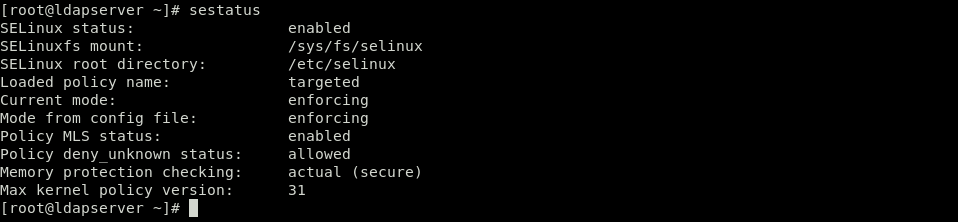

**2. Verificar que el valor (booleano) que permite al servicio HTTPD el acceso a LDAP está inhabilitado**

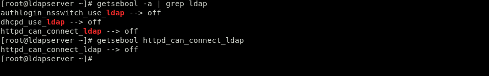

**3. Como usuario gus crear la carpeta /opt/docker que es donde estrán todos los ficheros necesarios para la instalación/configuración de LDAP y PHPLDAPADMIN**

  
[Ficheros de configuración LDAP y pasos para la instalación](./ldap/)  
[Ficheros de configuración PHPLDAPADMIN y pasos para la instalación](./phpldapadmin)  
[Ficheros de instalación conjunta](./instalacion)  

**3. Ejecutar el script startup.sh como root para poner en marcha LDAP y PHP ya que un usuario normal no puede modificar archivos de configuración.**

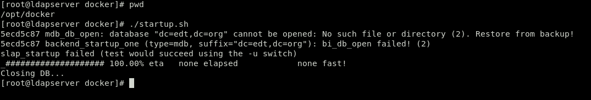

**4. Verificar que LDAP funciona mediante un ldapsearch.**

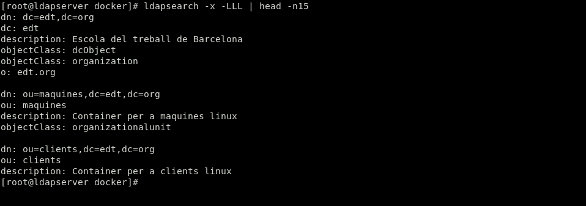

**5. En la máquina local editar el fichero /etc/host y añadir la siguiente linea "192.168.122.112 ldapserver" para evitar escribir todo el rato la IP da la máquina virtual**

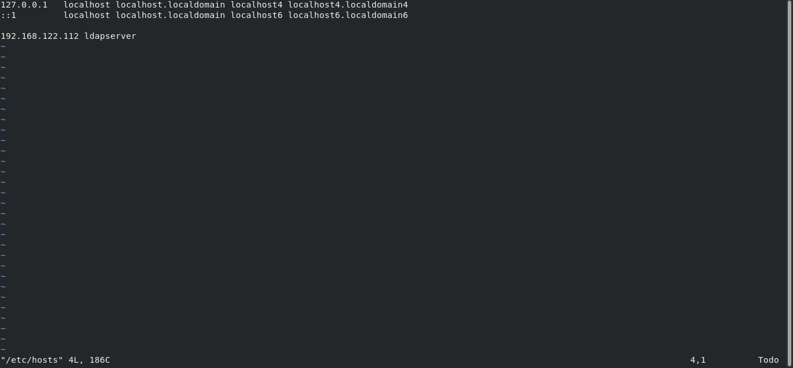

**6. Abrir un navegador en la máquina local y poner la siguiente url "http://ldapserver/phpldapadmin". Después conectarse como Manager y como anonimo para confirmar que SELinux negará el acceso a LDAP**

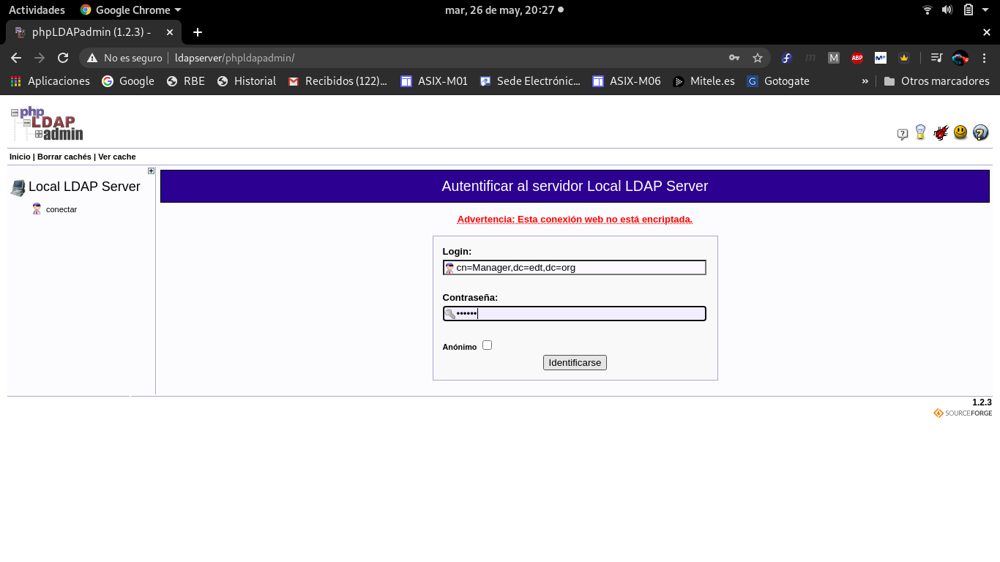
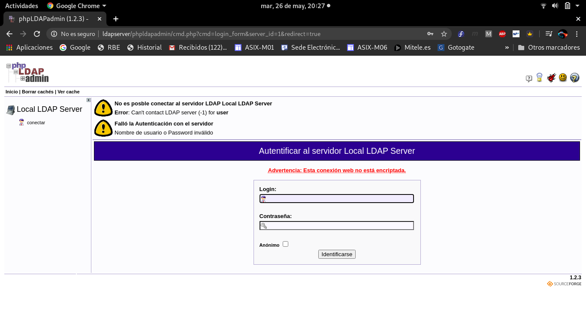

**7. Para permitir el acceso habilitar el valor (booleano) mediante la orden setsebool**

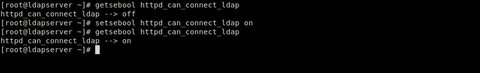

**8. Verificar que SELinux permite finalmente el acceso a LDAP**

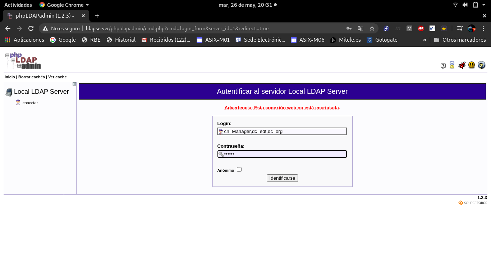
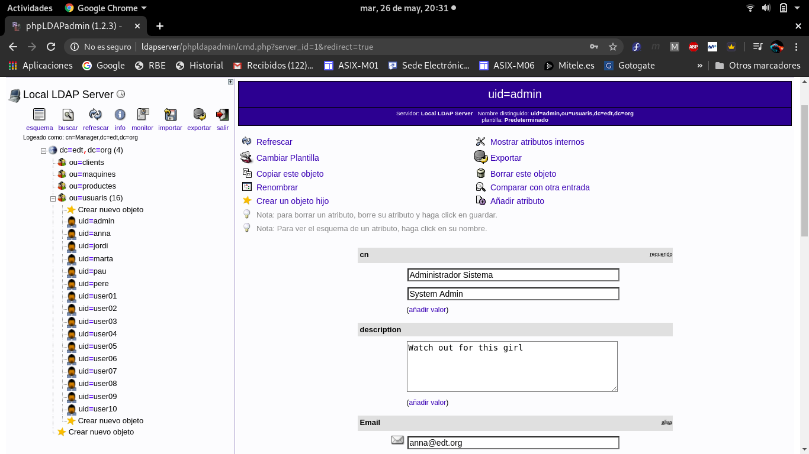
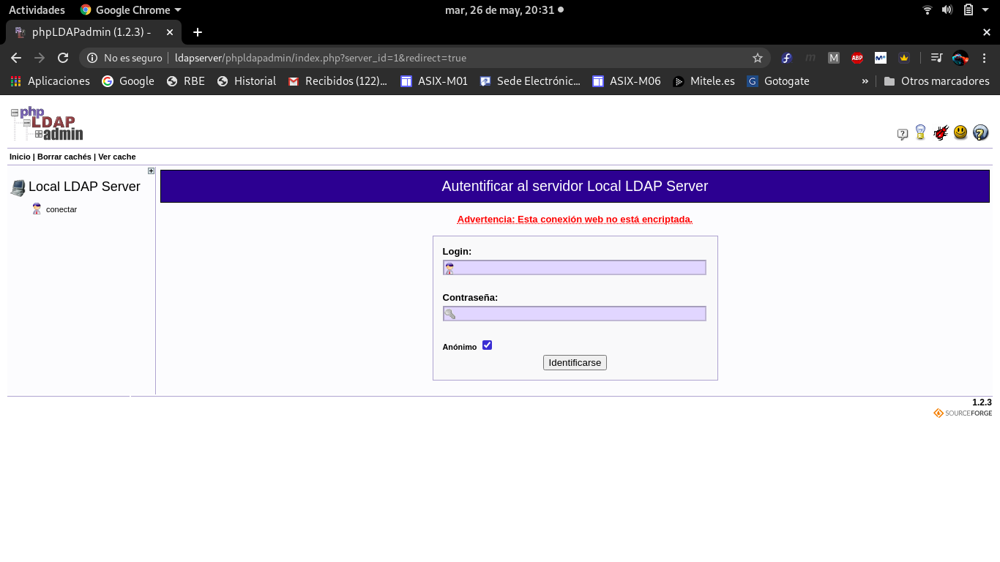
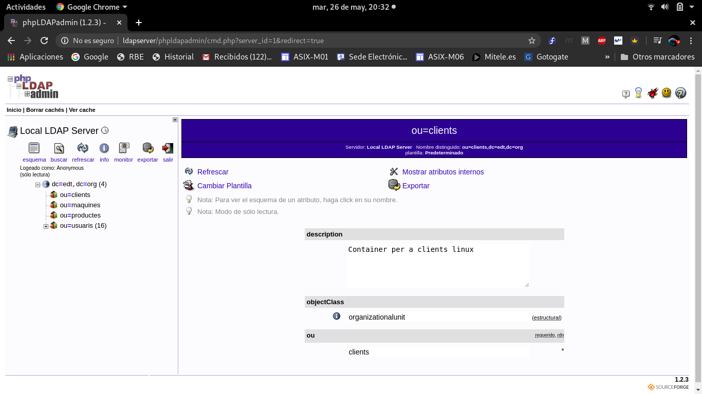

