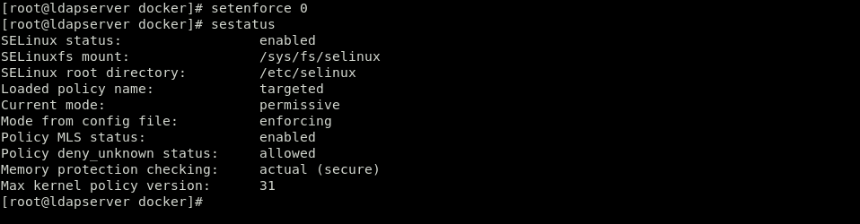
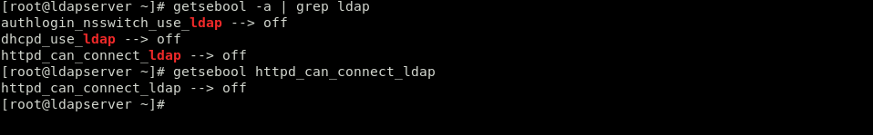
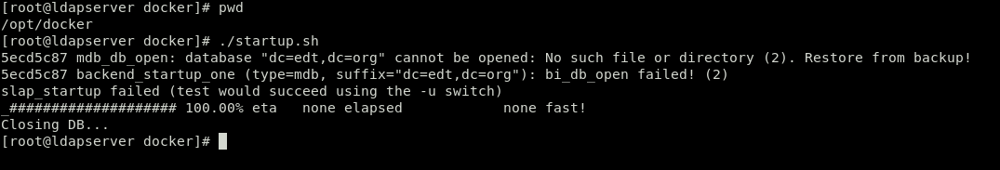
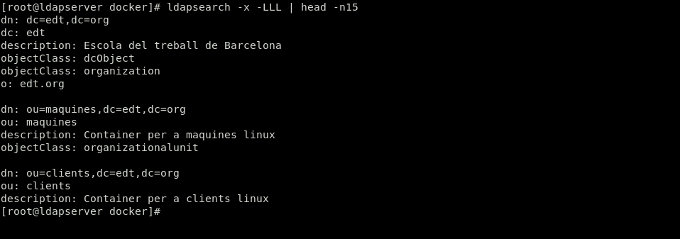
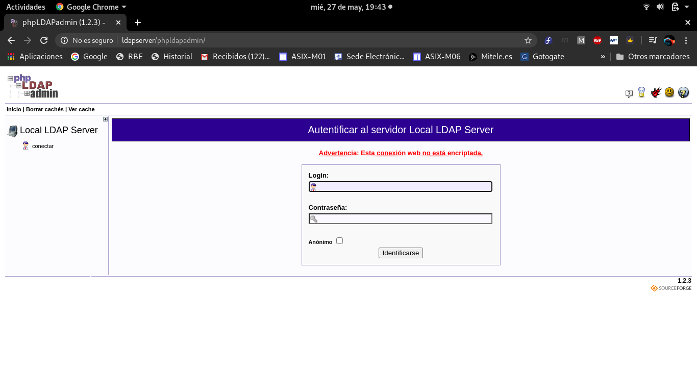
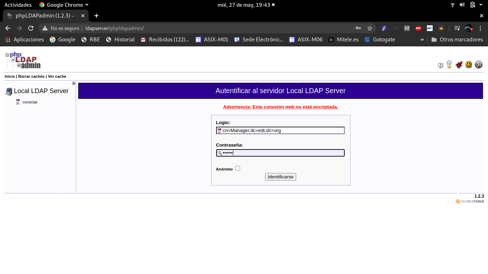
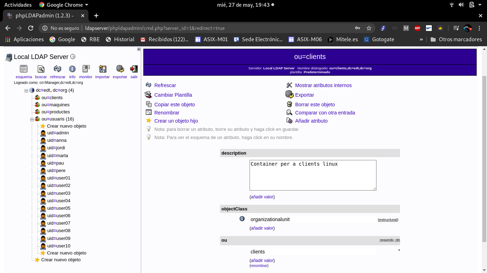

# EJEMPLO 

- Objetivo: Permitir el acceso a **LDAP** mediante la herramienta gráfica **PHPLDAPADMIN** cuando SELinux opera en modo **Permissive**

## Explicación

En la máquina virtual instalaré/configuraré **LDAP** y **PHPLDAPADMIN**, una vez instalados y configurados intentaré acceder a **LDAP**, esta vez SELinux no me negará el acceso, ya que se encuentra en modo **Permissive** y por lo tanto no realizará ninguna acción de negación sino que me permitirá acceder sin ningún problema.

### COMPROBACIONES

**1. Cambiar SELinux a modo de operación Permissive**

 

**2. Verificar que el valor (booleano) que permite al servicio HTTPD el acceso a LDAP está inhabilitado**

**3. Ejecutar el script startup.sh anteriormente creado para poner en marcha LDAP y PHP**

**4. Verificar que LDAP funciona mediante un ldapsearch.**

**5. Abrir un navegador y escribir la siguiente url "http://ldapserver/phpldapadmin". Después acceder como Manager o anonimo para verificar la connexión a LDAP**

