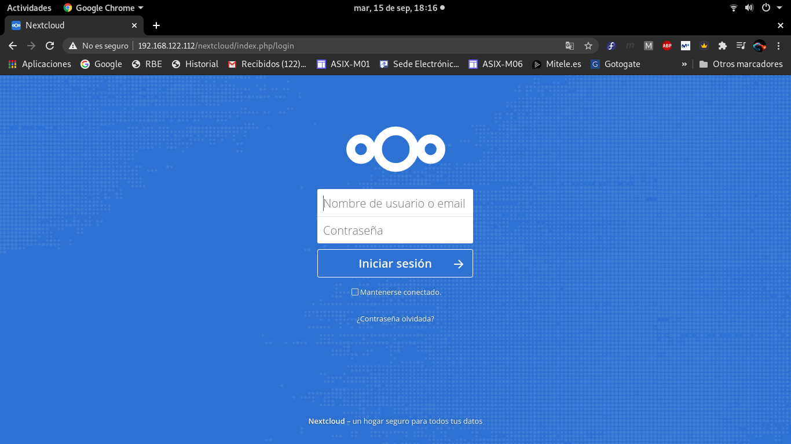
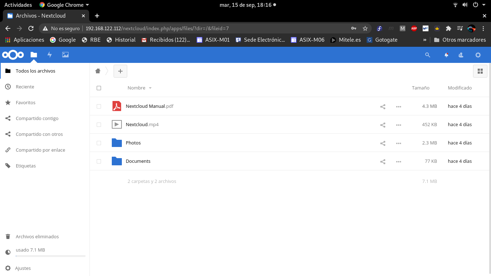

# PASOS PARA INSTALAR NEXTCLOUD

- Ejecutaremos Nextcloud sobre LAMP Server. LAMP(Linux, Apache, MySQL/MariaDB y PHP) define la infraestructura de un servidor web.


## 1. Instalación del servidor LAMP

**1. Instalar el servidor web Apache**

```
dnf -y install httpd
```

**2. Iniciar el servidor web**

```
systemctl start httpd
systemctl enable httpd
```

**3. Instalar MySQL/MariaDB Server**

```
dnf -y install mariadb-server
```

**4. Iniciar MariaDB**

```
systemctl start mariadb
systemctl enable mariadb
```

**5. Ejecutar el script mysql_secure_installation para mejorar la seguridad de la instalación de MariaDB**

```
mysql_secure_installation
```

**6. Crear un usuario y una base de datos para la instancia de Nextcloud**

```
mysql -p
 create database nextcloud;
 create user 'nc_admin'@'localhost' identified by 'SeCrEt';
 grant all privileges on nextcloud.* to 'nc_admin'@'localhost';
 flush privileges;
 exit;
```

**7. Instalar PHP**

```
dnf -y install php php-mbstring php-pear
```

## 2. Instalar modulos adicionales de PHP

```
dnf -y install php-zip php-pdo_mysql php-imagic php-ctype php-dom php-gd php-zlib
```

## 3. Instalación de Nextcloud Server

**1. Descargar Nextcloud**

```
wget https://download.nextcloud.com/server/releases/nextcloud-13.0.5.zip
```

**2. Extraer el zip**

```
unzip nextcloud-13.0.5.zip
```

**3. Cambiar el propietario al usuario Apache**

```
chwon -R apache:apache nextcloud
```

**4. Mover el directorio nextcloud a /var/www/html**

```
mv nextcloud /var/www/html/
```

## 4. Configuración de Nextcloud Server

```
# Poner en el navegador la siguiente linea:

http://IPhost/nextcloud

# En mi caso:
http://192.168.122.112/nextcloud
```

## 5. Comprobación final

**Comprobar que carga correctamente la pagina de login**



**Comprobar que entra correctamente con el usuario creado anteriormente**




