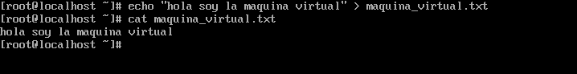
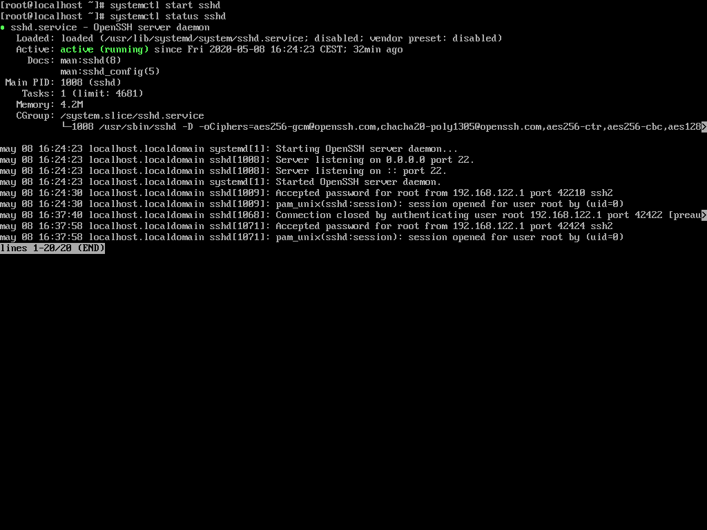
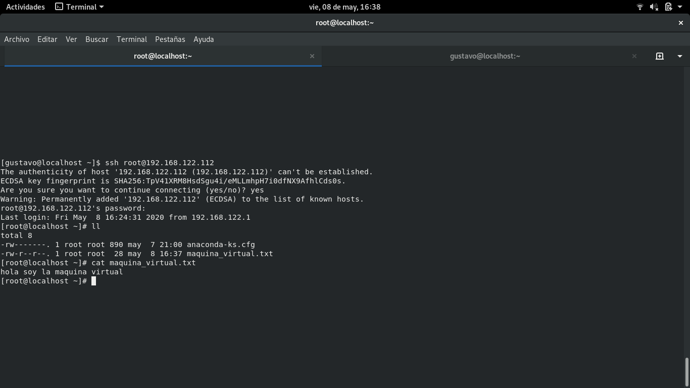

# COMPROBACIÓN DE ACCESO A LA MÁQUINA VIRTUAL DESDE MI HOST LOCAL

## Estructura

- IP máquina virtual: 192.168.122.112
- IP host local: 192.168.0.12

### Comprobación

**1. Crearemos un fichero senzillo en la maquina virtual, solo para comprobar que estamos en ella**

**2. Encendemos el servicio sshd para conectarnos remotamente desde el host local**

**3. Nos conectamos via ssh desde el host local a la maquina virtual**

**4. Comprobamos que la máquina virtual no tiene acceso al host local(anfitrión)**

