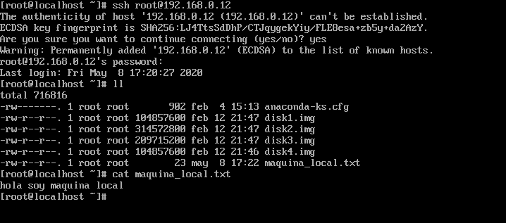

# COMPROBACIÓN DE ACCESO A LA MÁQUINA VIRTUAL DESDE MI HOST LOCAL

## Estructura

- IP máquina virtual: 192.168.122.112
- IP host local: 192.168.0.12

### Comprobación

**1. Creo un fichero sencillo en la maquina virtual, solo para comprobar que al conectarnos vía ssh estamos en ella**

**2. Enciendo el servicio sshd para conectarme remotamente desde el host local**

**3. Me conecto vía ssh desde el host local a la maquina virtual**

**4. Compruebo que la máquina virtual tiene acceso al host local(anfitrión)**

