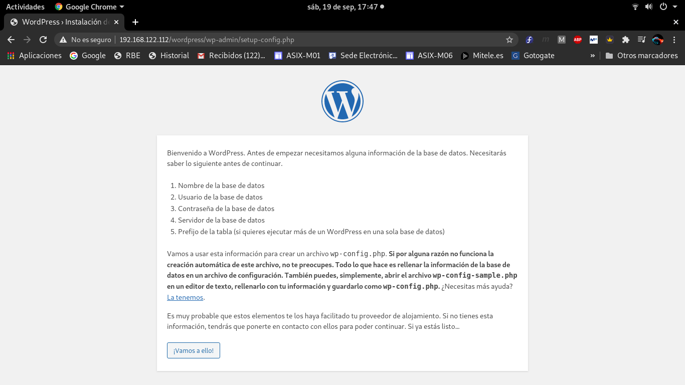
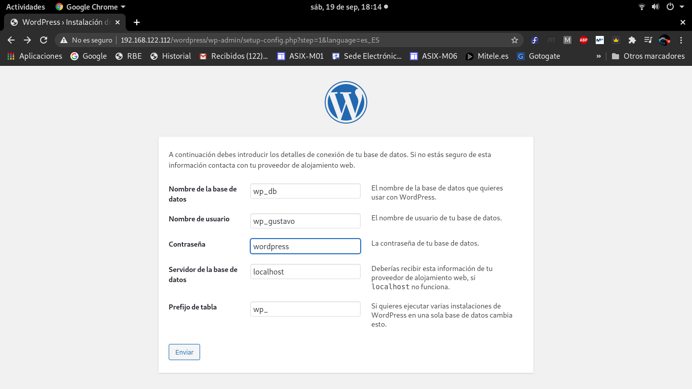
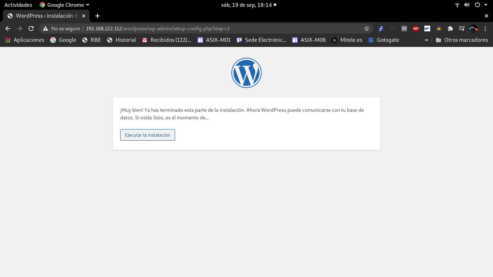
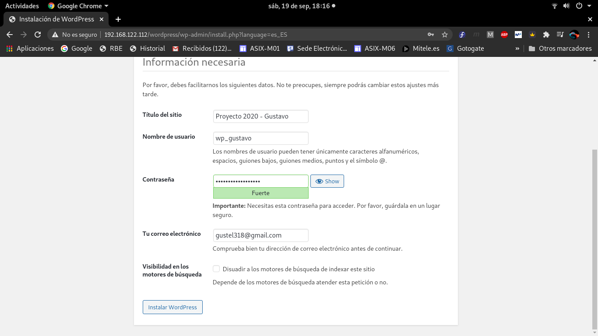
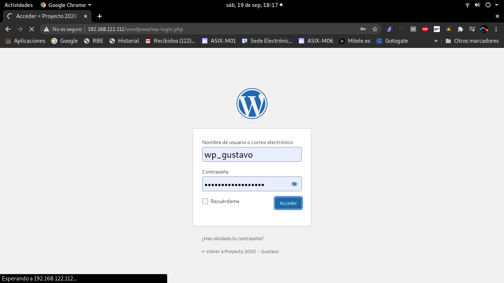
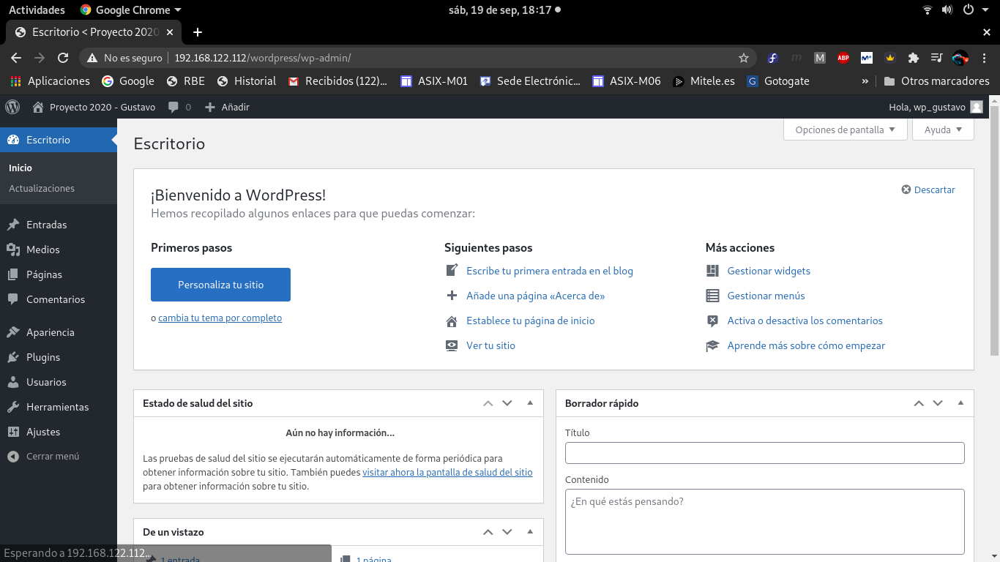

# PASOS PARA INSTALAR WORDPRESS

- Ejecutaremos Wordpress sobre LAMP Server. LAMP(Linux, Apache, MySQL/MariaDB y PHP) define la infraestructura de un servidor web.

## 1. Instalación del servidor LAMP

**Al tener el servidor LAMP instalado solo haremos los siguientes pasos**

**1. Crear un usuario y una base de datos para la instancia de Wordpress**

```
mysql -u root -p
 create database wp_db;
 grant all on wp_db.* to 'wp_gustavo'@'localhost' identified by 'wordpress';
 flush privileges;
 exit;
```

**2. Instalar módulos de PHP**

```
dnf -y install php-bcmath php-gd php-json php-mbstring php-pecl-imagick php-pecl-zip php-xml
```

**3. Reiniciar PHP**

```
systemctl restart php-fpm
```

## 2. Instalación de Wordpress

**1. Descargar Wordpress en formato tar.gz**

```
wget https://es.wordpress.org/latest-es_ES.tar.gz
```

**2. Descomprimir el fichero tar.gz**

```
tar xf latest-es_ES.tar.gz -C /var/www/html/
```

**3. Cambiar el propietario al usuario Apache**

```
chown -R apache:apache /var/www/html/wordpress/
```

### 2.1. Configuración SELinux-Wordpress

**1. Cambiar la etiqueta de la carpeta de instalación de Wordpress**

```
semanage fcontext -a -t httpd_sys_rw_content_t "/var/www/html/wordpress(/.*)?"
```

**2. Definir la etiqueta del paso denaterior de manera permanente**

```
restorecon -R /var/www/html/wordpress/
```

**3. Para evitar que SELinux bloquee el acceso de la aplicación a Internet para la instalación y actualización de módulos y aplicaciones, activar el booleano httpd_can_network_connect**

```
setsebool -P httpd_can_network_connect on
```

## 3. Configuración Wordpress

**1. Poner en el navegador la siguiente linea**

```
http://IPhost/wordpress

# En mi caso:
http://192.168.122.112/wordpress
```

**2. Comprobar que carga correctamente la pagina**



**3. Rellenar el formulario con los datos de conexión al sistema de base de datos**



**4. Comprobar que se ha rellando correctamente el formulario**



**5. Rellenar el nuevo formulario con nuestra información básica**



**6. Una vez rellenado el formulario, se podrá inicar sesión con nuestro usuario y contraseña proporcionada**






