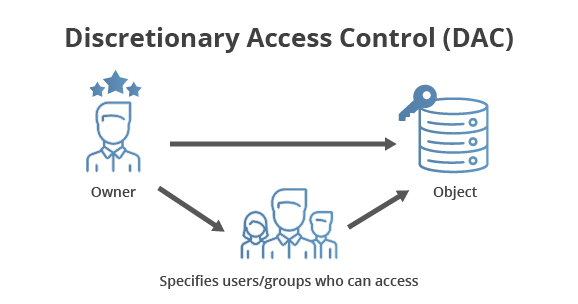
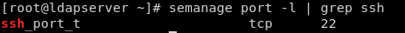
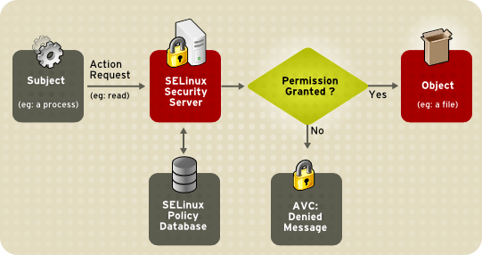
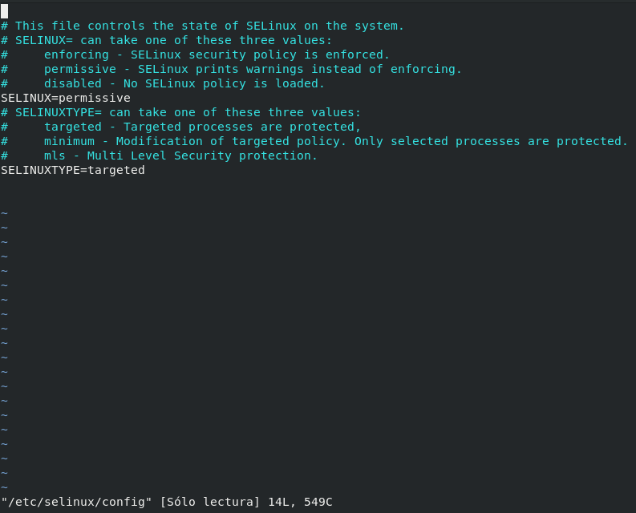

# PROYECTO - Linux de Seguridad Mejorada: SELinux

+ Gustavo Tello Beltran
+ isx43577298

## ÍNDICE

+ [Documentación](#Documentación)
  + [Información básica](#Información-básica)
  + [Introducción](#Introducción)
  + [Arquitectura](#Arquitectura)
    + [Funcionamiento](#Como-funciona)
    + [Políticas](#Tipos-de-políticas)
      + [Modos de operación](#Modos-de-operación)
  + [Configuración](#Como-se-configura-y-que-ficheros-utiliza)
  + [Comandos](#Comandos)
+ [Proceso Práctico](#Proceso-Práctico)
  + [Creación de maquina virtual en KVM](#Máquina-KVM)
  + [Ejemplos prácticos](#Ejemplos-prácticos)

### Documentación

#### Información básica

SELinux (Linux de Seguridad Mejorada) es una arquitectura de seguridad que viene integrado en el kernel Linux desde la version 2.6 que implementa módulos para mejorar la seguridad. Esta dirigida para administradores de servidores, quienes deben de implementar las políticas para otorgar o negar privilegios a un usuario sobre los objetos del sistema(archivos, puertos, sockets y otros procesos).

No reemplaza el modelo tradicional de seguridad de Linux y sirve como complemento para cubrir los puntos debiles que existen en el sistema, por esta razon es importante no deshabilitarlo.

#### Introducción

Los archivos, directorios y dispositivos se llaman objetos. Los procesos, como un comando que ejecuta el usuario o la aplicación Mozilla Firefox, se llaman sujetos.  

La mayoría de los sistemas operativos usan una **arquitectura de Control de Acceso Discrecional(DAC)**, que controla cómo interactuan los sujetos con los objetos, y cómo los sujetos interactuan entre sí, los usuarios controlan los permisos de archivos (**objetos**) de los que son dueños. Por ejemplo, en sistemas operativos Linux, los usuarios pueden hacer sus directorios legibles para el resto del mundo, dando a los usuarios y procesos (sujetos) acceso a información potencialmente sensible.  

```
$ ls -l archivo1
-rwxrw-r-- 1 usuario1 grupo1 0 2020-05-30 15:42 archivo1
```

Los primeros tres bits de permisos, **r(lectura),w(escritura),x(ejecucion)**, controlan el acceso que el usuario Linux usuario1 (en este caso, el dueño) tiene para el archivo1. Los siguientes tres bits de permisos, rw-, controlan el acceso que el grupo Linux grupo1 tiene para el archivo1. Los últimos tres bits de permisos, r--, controlan el acceso que todo el mundo tiene para el archivo1, que incluyen a todos los usuarios y procesos.

Los mecanismos DAC son fundamentalmente inadecuados para una fuerte seguridad del sistema. Las decisiones de acceso DAC son sólo basadas en la identidad del usuario y su propiedad, ignorando información de seguridad relevante tal como el rol del usuario, la función y la confiabilidad del programa, y la sensibilidad e integridad de los datos. Cada usuario tiene completa discreción sobre sus archivos, haciendo imposible aplicar una política de seguridad a nivel de sistema. Más aún, cada programa que ejecuta un usuario hereda todos los permisos garantizados al usuario y es libre de cambiar el acceso de archivos del usuario, por lo que no se provee una protección contra software malicioso. Muchos servicios del sistema y programas privilegiados deben ejecutarse con privilegios más allá de lo que realmente necesitan, por lo que una brecha en cualquiera de estos programas se puede explotar para obtener acceso completo al sistema

<center>  

  

</center>  

SELinux en cambio agrega una **arquitectura de Control de Acceso Obligatorio (MAC)** al kernel de Linux y las distribuciones GNU/Linux Fedora, Red Hat Enterprise Linux, CentOS y Scientific Linux incorporan SELinux habilitado por defecto a la hora de la instalación del sistema operativo.


Esta arquitectura aplica una política de seguridad puesta administrativamente sobre todos los procesos y archivos del sistema, basando decisiones en las etiquetas que contienen información variada relevante para la seguridad. Estas etiquetas se asignan cuando se inicia el sistema y se llama proceso de etiquetado. El modelo MAC permite la ejecución a salvo de aplicaciones no confiables, hace que la información esté protegida de los usuarios legítimos con autorización limitada, así como de usuarios autorizados que involuntariamente ejecutaron aplicaciones maliciosas.  

En el caso de que se quiera hacer un reetiquetado del sistema, se creará un fichero vacío llamado **.autorelabel** en el directorio raíz y después se reiniciará el sistema para completar el proceso.


Ejemplo de las etiquetas que contienen información de seguridad relevante que se usa en los procesos, usuarios Linux y archivos, en sistemas operativos Linux que corren SELinux. Esta información se llama contexto de SELinux y se visualiza usando el comando **ls -Z**:  
```
$ ls -Z file1
-rwxrw-r--  user1 group1 unconfined_u:object_r:user_home_t:s0      file1
```
En este ejemplo, SELinux provee un **usuario (unconfined_u), un rol (object_r), un tipo (user_home_t), y un nivel (s0)**. Esta información se usa para tomar decisiones sobre el control de acceso. Con DAC, el acceso se controla basado sólo en los IDs de usuarios y grupos de Linux.   

Las reglas de políticas de SELinux se chequean después de las reglas DAC, en caso de que las reglas DAC denieguen el acceso al principio no se mirarán las políticas.

<center>


</center>

**Partes de una etiqueta**

```
Usuario - Identidad del usuario SELinux. Cada usuario del sistema se mapea a un usuario SELinux para limitar el acceso y estos se identifican con el sufijo _u.

Rol - Forma parte del Control de Acesso Basado en Roles (RBAC). Limita el acceso de un usuario del sistema que tenda un determinado rol de SELinux. Por defecto todos tienen el rol object_r y se identifican con el sufijo _r.

Tipo - Determina los permisos de acceso, es decir, la política de seguridad a usar. El tipo de objeto de un proceso se llama domininio y se identifican con el sufijo _t.

Nivel -  Son extensiones que permiten un control aún más preciso mediante un etiquetado adicional con dos entidades: sensibilidad y categoría.

```

El **nivel** es opcional y el **tipo** es el aspecto más importante de la **Política Específica**. El **usuario, rol y nivel** se utilizan en implementaciones más avanzadas de SELinux, como la **Seguridad Multinivel (MLS)**.


#### Arquitectura

#### Como funciona

SELinux se maneja por reglas de políticas, por ejemplo cuando un acceso de seguridad relevante se lleva a cabo, como un proceso que trata de abrir un archivo, la operación es interceptada. Si una regla de las políticas permite la operación, continúa, sino la operación se bloquea y el proceso recibe un error.  

**Ejemplo de una regla**

<center>



Regla que establece el puerto por el cual se puede acceder al servidor **SSHD**.

</center>

Las decisiones de SELinux, tales como permitir o negar accesos, son cacheadas. Este caché se conoce como **Caché Vector de Acceso (AVC)**. Las decisiones de cacheado disminuye la necesidad de que las reglas de las políticas sean chequeadas muy a menudo, lo que mejora el funcionamiento.   

<center>




Estas políticas se guardan en el fichero **/etc/selinux/targeted/policy/policy.[version]**

</center>

**Las reglas de políticas de SELinux no tienen efecto si las reglas DAC niegan el acceso primero.**


**Ejemplo de un mensaje de error**

<center>

  

Los mensajes de error se puede visualizar en el fichero **/var/log/messages**.

</center>

**Partes del mensaje**  

+ **avc: denied**:	Se denegó una operación.
+ **{ read }**:	Esta operación necesita los permisos read y write.  
+ **pid=1484**:	El proceso con PID 1484 ejecutó la operación (o intentó hacerlo).
+ **comm="httpd"**:	Este proceso es una instancia del servidor httpd.
+ **name="myconf.conf"**:	El objeto de destino se llamaba myconf.conf. En ciertos casos también se puede tener una variable «path» con una ruta completa.
+ **dev=dm-0**:	El dispositivo que alberga el objeto destino es un dm-0, un dispositivo lógico LVM.
+ **ino=794975**:	El objeto está identificado por el número de inodo 794975.
+ **scontext=system_u:system_r:httpd_t:s0**:	Este es el contexto de seguridad del proceso que ejecutó la operación.
+ **tcontext=unconfined_u:object_r:user_home_t:s0**:	Este es el contexto de seguridad del objeto destino.
+ **tclass=file**:	El objeto destino es un archivo.
+ **permissive=0**: El modo de operación permissive está desactivado.


#### Tipos de políticas

SELinux incorpora dos tipos de políticas:

**Política Específica**: sólo los procesos que cuenten con una política de seguridad están bajo el control SELinux, por ejemplo, algunos procesos relevantes, como apache, nginx, dns, proxy squid, snmp y syslog. Es la política por defecto y proporciona un control bastante eficaz y sencillo. Los procesos sin una política quedan fuera del contexto de seguridad de SELinux y sobre ellos se aplica la seguridad estándar de Linux (DAC).  

**Política multi-nivel/multi-categoria (MLS/MCS)**: habilita la seguridad multi-nivel o multi-categoría.

##### Modos de operación

SELinux puede trabajar en tres modos de configuración:

1. **Disabled**: No carga el conjunto de políticas definidas y tampoco realiza el etiquetado de los objetos. No se recomienda utilizar este modo,ya que si más adelante se pretende activar SELinux, este puede caer en un estado de inconsistencia de las reglas y políticas en el caso de haber creado archivos, directorios, procesos o servicios instalados que no están etiquetados.

2. **Permissive**: Carga las políticas definidas y registra las acciones en el archivo log (depende la configuración), sin embargo, no realiza ninguna acción de denegación. Este modo se suele utilizar para diseñar y depurar políticas, pero no se recomienda para entornos de producción.

3. **Enforcing**: Carga las políticas definidas y permite o niega el acceso a objetos del sistema. Este es el modo que recomiendan para entornos de producción.


#### Como se configura y que ficheros utiliza

Para saber con qué configuración se ejecuta el sistema, basta con consultar el archivo **/etc/sysconfig/selinux**. El archivo contendrá una sección donde se indicará si SELinux se encuentra en modo enforcing, permissive o disabled, y qué política se debería cargar targeted, minimum o mls .



1. **targeted**: todos los procesos están protegidos
2. **minimum**: solo los procesos seleccionados están protegidos.
3. **mls**: protección de seguridad multinivel.

**El archivo /etc/sysconfig/selinux contiene un enlace simbólico al archivo de configuración real, /etc/selinux/config.**

El directorio /etc/selinux/ es la ubicación principal para todos los archivos de políticas y también del archivo de configuración principal.

[Contenido del directorio /etc/selinux](../img/etc_selinux.png)


#### Comandos

[Comando seinfo](../aux/ordenes/seinfo.md)

[Comando getsebool/setsebool](../aux/ordenes/getsebool.md)

[Comando semodule](../aux/ordenes/semodule.md)

[Comando getenforce/setenforce](../aux/ordenes/getenforce.md)

[Comando semanage](../aux/ordenes/semanage.md)

[Comando sestatus](../aux/ordenes/sestatus.md)

[Comando chcon](../aux/ordenes/chcon.md)

[Comando restorecon](../aux/ordenes/restorecon.md)

[Comando getfacl](../aux/ordenes/getfacl.md)

### Proceso Práctico

#### Máquina KVM

Descarto crear un docker ya que no se puede manipular las políticas, los roles de los usuarios ni el modo de operación en el que trabaja SELinux.
El sistema de etiquetaje lo hace correctamente pero al manipular SELinux siempre salta el mensaje de que está en modo disabled.

Crearé una maquina virtual en KVM(Kernel-based Virtual Machine) con la imagen de un Fedora-29, que es el mismo que tengo en mi maquina local. Una vez instalada escojo la configuración por defecto de red de la máquina virtual, en este caso, NAT. Este modo permite a las máquinas virtuales conectarse hacia el exterior utilizando la IP del anfitrión, pero las máquinas exteriores, excepto el anfitrión, no pueden conectarse a la máquina virtual.

[Configuración de la red de la maquina virtual](../img/configuracion_red_mv.png)

[Comprobaciones de acceso](../aux/test.md)

#### Ejemplos prácticos

**Ejemplo 1**

- Servidor SSHD
- Modo de operación de SELinux: **Enforcing**
- Gestión de reglas
  - Orden: **semanage**

En este ejemplo demostraré como el modo de operación Enforcing permite o niega el acceso a objetos del sistema según las políticas definidas por defecto utilizando el servicio SSHD.


[Comprobaciones ejemplo 1](../aux/1-ejemplo.md)


**Ejemplo 2**

- Servidor SSHD
- Modo de operación de SELinux: **Permissive**
- Gestión de reglas
  - Orden: **semanage**

En este ejemplo demostraré como el modo de operación Permissive solo registra las acciones denegadas pero las ejecuta igualmente utilizando el servicio SSHD.

[comprobaciones ejemplo 2](../aux/2-ejemplo.md)

**Ejemplo 3**

- Servidor Apache
- Modo de operación de SELinux: **Enforcing**

En este ejemplo mostraré como encontrar en los logs cuando queremos que el servidor apache utilice un directorio virtual des de otro directorio que no sea el que tiene por defecto (/var/www/html) cuando SELinux esté operando en modo Enforcing

[comprobaciones ejemplo 3](../aux/3-ejemplo.md)

**Ejemplo 4**

- Servidor Apache
- Modo de operación de SELinux: **Permissive**

En este ejemplo mostraré como encontrar en los logs cuando queremos que el servidor apache utilice un directorio virtual des de otro directorio que no sea el que tiene por defecto (/var/www/html) cuando SELinux esté operando en modo Permissive

[Comprobaciones ejemplo 4](../aux/4-ejemplo.md)

**Ejemplo 5**

- LDAP y PHPLDAPADMIN
- Modo de operación de SELinux: **Enforcing**


En este ejemplo mostraré como SELinux niega el acceso a **LDAP** utilizando la herramienta de interfaz gráfica **PHPLDAPADMIN**, cuando SELinux opere en modo **Enforcing**.

[Comprobaciones ejemplo 5](../aux/5-ejemplo.md)


**Ejemplo 6**

- LDAP y PHPLDAPADMIN
- Modo de operación de SELinux: **Permissive**

En este ejemplo mostraré como SELinux permite el acceso a **LDAP** utilizando la herramienta de interfaz gráfica **PHPLDAPADMIN**, cuando SELinux opere en modo **Permissive**.

[Comprobaciones ejemplo 6](../aux/6-ejemplo.md)

**Ejemplo 7**

- Nextcloud y LDAP
- Modo de operacion de SELinux: **Enforcing**

En este ejemplo mostraré como SELinux no permite el acceso a **LDAP** utilizando el servidor **Nextcloud**, cuando SELinux opere en modo **Enforcing**.

[Comprobaciones ejemplo 7](../aux/7-ejemplo.md)


**Ejemplo 8**

- Wordpress
- Modo de operacion de SELinux: **Enforcing**

En este ejemplo mostraré como instalar Wordpress cuando esté activo el modo de operación **Enforcing** de SELinux, cambiando el contexto de seguridad de los archivos de configuración.


[Comprobaciones ejemplo 8](../aux/8-ejemplo.md)

**Ejemplo 9**

- Moddle
- Modo de operacion de SELinux: **Enforcing**

En este ejemplo mostraré como instalar Moodle cuando esté activo el modo de operación **Enforcing** de SELinux, cambiando el contexto de seguridad de los archivos de configuración.

[Comprobaciones ejemplo 9](../aux/9-ejemplo.md)


**Ejemplo 10**

- ACL's
- Demostración de las ordenes setfacl y getfacl

En este ejemplo mostraré el comportamiento de las ACL en tres situaciones diferentes y como actúan las reglas **DAC** y **MAC**.

[Comprobaciones ejemplo 10](../aux/10-ejemplo.md)
