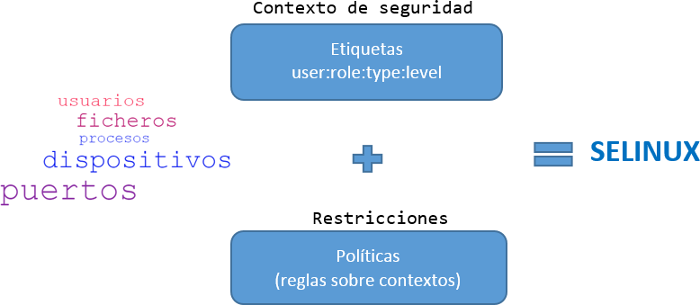
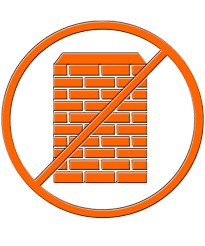

### SELinux

### Etiquetaje

- Sistema de etiquetado
- Formato de etiqueta (user:role:type:level)

### Políticas

- Asociada a una etiqueta
- Se ejecutarán solo en el modo de operación Enforcing

### Tipos de Control

- Control de Acceso Discrecional(DAC)
- Control de Acceso Obligatorio(MAC)
  - MAC basado en etiquetas
  - Control de Acceso Basado en Roles(RBAC)

### Modos de Operación

- Enforcing
- Permissive
- Disabled

### Es un firewall?

- NO!
- Diferencias SELinux vs Firewall

### Como lo tengo montado?

### Problema: Docker I

### Problema: Docker II

### Solución: KVM

- Solución para implementar virtualización completa con Linux

