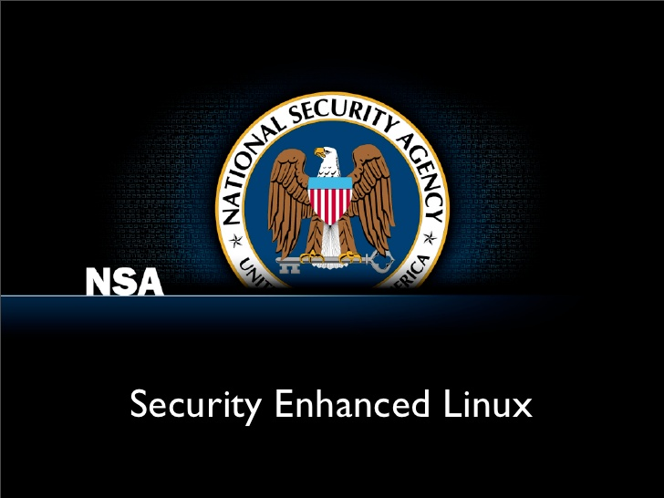
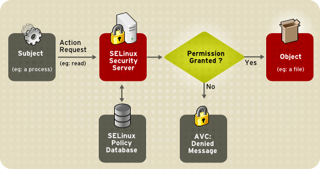
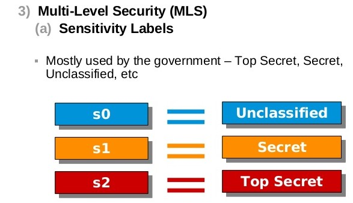
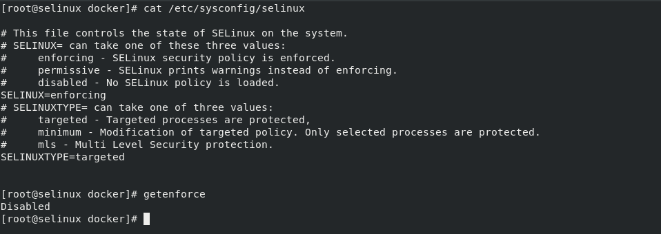
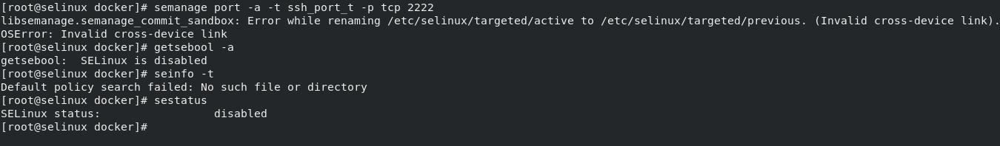
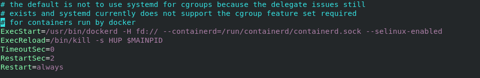
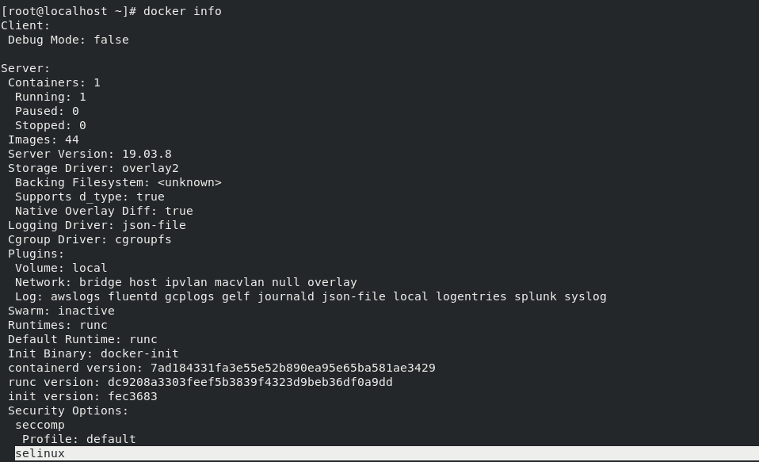
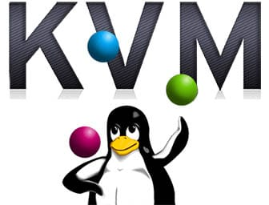
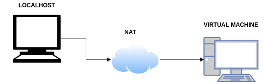

### SELINUX (Security Enhaced Linux)

### Introducción

- Linux de Seguridad Mejorada
- Modulo de seguridad de Linux
- Aplica una capa de seguridad adicional al sistema
- Viene habilitado por defecto a la hora de instalar el SO
- Al iniciarse el sistema aplica su contexto de seguridad

### Como funciona

SELinux responde fundamentalmente a la pregunta: ¿Puede un **sujeto** hacer **x accion** sobre un **objeto**?

### MAC vs DAC

- **DAC**
 - Se basa en propietarios y grupos
 - Utiliza los permisos clásicos de los sistemas UNIX
   - lectura
   - escritura
   -  ejecución
 - Se gestionan los permisos con el comando **chmod**

- **MAC**
 - Se basa en reglas
 - Aplica su propio contexto de seguridad
 - Se gestionan las reglas con el comando **semanage**
 - Si las reglas DAC niegan el acceso las reglas MAC no se aplican

### Tipos de política

Existen dos tipos de políticas:
- **Política Específica**
- **Política MLS**

### Política Específica

- Es la política predeterminada
- Cada etiqueta va asociada a una regla
- El **tipo** es el aspecto más importante
- El **nivel** es opcional

### Política Específica: Etiqueta

- Es el contexto de seguridad de todos los objetos y sujetos
- Crear un fichero llamado **.autorelabel** en el directorio raíz si se requiere un reetiquetado del sistema
- Según el **tipo** de etiqueta se aplicará la regla que va asociada
- Se gestionan con los comandos:
  - **restorecon**
  - **chcon**

### Política Específica: Reglas

- Se gestionan con el comando **semanage**
  -  Además gestionan los booleanos y los roles de usuarios y los niveles
- Van asociados al **tipo** de etiqueta del objeto
- El mensaje de error de una regla se almacen en el AVC(Caché de Vector de Acceso)

### Política Específica: Booleanos

- Los booleanos permiten cambiar partes de la política de SELinux en tiempo de ejecución, sin necesidad de crear/modificar reglas
- Se gestionan con los comandos **getsebool** y **setsebool**

### Política Específica: Usuarios

- Se le da un rol a un usuario de Linux
- Para visualizar el rol de un usuario se utiliza el comando **id -Z**

[Insertar imagen de rol en la máquina virtual ejecutando semanage login -l]

### Tipos de política: MLS

- Seguridad Multinivel
- Se usa en implementaciones más avanzadas
- El **usuario**, **rol** y **nivel** son los aspectos más importantes

### Modos de Control y Operación III: Modos de Operación

- **Enforcing:** Permite o niega el acceso a objetos guiándose por las reglas definidas por defecto
- **Permissive:** No realiza ninguna acción de denegación, solo registra las acciones no permitidas en los logs del sistema

- **Disabled:** No se recomienda utilizar este modo si luego queremos activar SELinux

- Para poder visualizar el modo de operación en el que trabaja SELinux se utiliza el comando **getenforce** o **sestatus** si se quiere más información. Para cambiar de modo de operación se utiliza el comando **setenforce**.

### Estructura proyecto: Problema Docker I

### Estructura proyecto: Problema Docker II

### Estructura proyecto: Solución KVM

- Solución para implementar virtualización completa con Linux

### Estructura proyecto: Como lo tengo montado?

### Y eso es todo!

