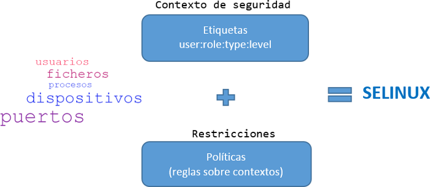
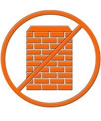
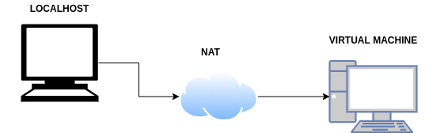
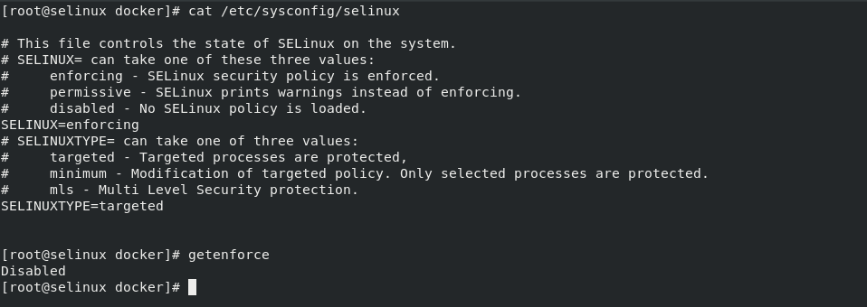
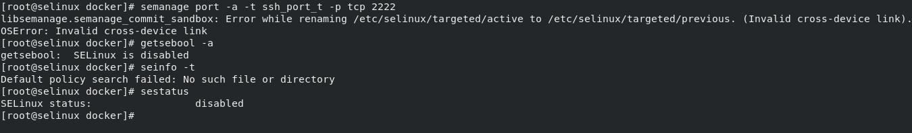
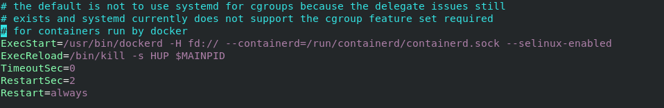
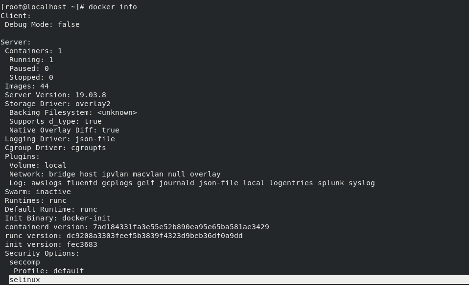

### SELinux

### Etiquetaje

+ Sistema de etiquetado
+ Formato de etiqueta (user:role:type:level)

### Políticas

+ Asociada a una etiqueta
+ Se ejecutarán solo en el modo de operación Enforcing

### Tipos de Control

+ Control de Acceso Discrecional(DAC)
+ Control de Acceso Obligatorio(MAC)
  + MAC basado en etiquetas
  + Control de Acceso Basado en Roles(RBAC)

### Modos de Operación

+ Enforcing
+ Permissive
+ Disabled

### Es un firewall?

+ NO!
+ Diferencias SELinux vs Firewall

### Como lo tengo montado?

### Problema: Docker I

### Problema: Docker II

### Solución: KVM

+ Solución para implementar virtualización completa con Linux

