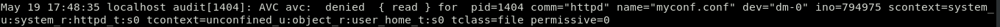
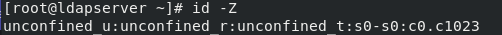

### SELINUX (Security Enhaced Linux)

### Introducción

- Linux de Seguridad Mejorada
- Modulo de seguridad de Linux
- Aplica una capa de seguridad adicional al sistema
- Viene habilitado por defecto a la hora de instalar el SO
- Al iniciarse el sistema aplica su contexto de seguridad

### Como funciona

SELinux responde fundamentalmente a la pregunta: ¿Puede un **sujeto** hacer **x accion** sobre un **objeto**?

### MAC vs DAC

- **DAC**
 - Se basa en propietarios y grupos
 - Utiliza los permisos clásicos de los sistemas UNIX
   - rwx
   - lectura, escritura, ejecución
 - Se gestionan los permisos con el comando **chmod**

- **MAC**
 - Se basa en reglas
 - Aplica su propio contexto de seguridad
 - Si las reglas DAC niegan el acceso las reglas MAC no se aplican
 - Se gestionan las reglas con el comando **semanage**

### Tipos de política

Existen dos tipos de políticas:
- **Política Específica**
- **Política MLS**

### Política Específica

- Es la política predeterminada
- Cada regla tiene asociada una etiqueta
- El **tipo** es el aspecto más importante
- El **nivel** es opcional

### Política Específica: Etiqueta

- Es el contexto de seguridad de todos los objetos y sujetos
- Según el **tipo** de etiqueta se aplicará la regla que va asociada
- Se gestionan con los comandos:
  - **restorecon**
  - **chcon**
- Para visualizar la etiqueta de un **objeto** se utiliza el comando **ls -Z**
- Para visualizar la etiqueta de un **sujeto** se utiliza el comando **id -Z**
- Crear un fichero llamado **.autorelabel** en el directorio raíz si se requiere un reetiquetado del sistema

### Política Específica: Reglas

- Se gestionan con el comando **semanage**
  -  Además gestionan los booleanos, los roles de usuarios y los niveles
- Van asociados al **tipo** de etiqueta del objeto
- El mensaje de error de una regla se almacen en el AVC(Caché de Vector de Acceso)

### Política Específica: AVC (Caché de Vector de Acceso)

+ **avc: denied**:	Se denegó una operación.
+ **{ read }**:	Esta operación necesita los permisos read.  
+ **pid=1484**:	El proceso con PID 1484 ejecutó la operación (o intentó hacerlo).
+ **comm="httpd"**:	Este proceso es una instancia del servidor httpd.
+ **name="myconf.conf"**:	El objeto de destino se llamaba myconf.conf. En ciertos casos también se puede tener una variable «path» con una ruta completa.
+ **dev=dm-0**:	El dispositivo que alberga el objeto destino es un dispositivo lógico LVM.
+ **ino=794975**:	El objeto está identificado por el número de inodo 794975.
+ **scontext=system_u:system_r:httpd_t:s0**:	Este es el contexto de seguridad del proceso que ejecutó la operación.
+ **tcontext=unconfined_u:object_r:user_home_t:s0**:	Este es el contexto de seguridad del objeto destino.
+ **tclass=file**:	El objeto destino es un archivo.
+ **permissive=0**: El modo de operación permissive está desactivado.

### Política Específica: Booleanos

- Los booleanos permiten cambiar partes de la política de SELinux en tiempo de ejecución, sin necesidad de crear/modificar reglas
- Se gestionan con los comandos **getsebool** y **setsebool**
  - Cambiar el estado de un booleano: **setsebool booleano_name [on|off]**
  - Ver todos los booleanos: **getsebool -a**
- Fichero que permite cambiar el nombre de los booleanos
  - **/etc/selinux/targeted/booleans.subs_dist**

### Política Específica: Usuarios

- Se le da un rol a un usuario de Linux
- Directorio donde se guardan los usuarios de SELinux
  - **/etc/selinux/targeted/contexts/users/**

### Tipos de política: MLS

- Seguridad Multinivel
- Se usa en implementaciones más avanzadas
- El **usuario**, **rol** y **nivel** son los aspectos más importantes

### Modos de Control y Operación III: Modos de Operación

- **Enforcing:** Permite o niega el acceso a objetos guiándose por las reglas definidas por defecto

- **Permissive:** No realiza ninguna acción de denegación, solo registra las acciones no permitidas en los logs del sistema

- **Disabled:** No se recomienda utilizar este modo si luego queremos activar SELinux

- Para poder visualizar el modo de operación en el que trabaja SELinux se utiliza el comando **getenforce** o **sestatus** si se quiere más información. Para cambiar de modo de operación se utiliza el comando **setenforce**.

### Estructura proyecto: Problema Docker I

### Estructura proyecto: Problema Docker II

### Estructura proyecto: Solución KVM

- Solución para implementar virtualización completa con Linux

### Estructura proyecto: Como lo tengo montado?

### Y eso es todo!

