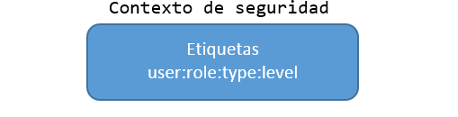

### SELINUX (Security Enhaced Linux)

### Introducción

- Linux de Seguridad Mejorada
- Modulo de seguridad de Linux
- Aplica una capa de seguridad adicional al sistema
- Viene habilitado por defecto a la hora de instalar el SO
- Al iniciarse el sistema aplica su contexto de seguridad

### MAC vs DAC

- **DAC**
 - Se basa en propietarios y grupos
 - Es discrecional
 - Se gestionan los permisos con el comando **chmod**

- **MAC**
 - Se basa en políticas
 - No es discrecional
 - Se gestionan las reglas con el comando **semanage**

### Tipos de política

Existen dos tipos de políticas:
- **Política Específica**
- **Política MLS**

### Política Específica

- Es la política predeterminada
- El **tipo** es el aspecto más importante
- El **nivel** es opcional
- Cada etiqueta va asociada a una regla

### Política Específica: Etiqueta

- Es el contexto de seguridad de todos los objetos y sujetos
- Según el tipo de etiqueta se aplicará la regla que va asociada
- Se gestionan con los comandos:
  - **restorecon**
  - **chcon**

### Política Específica: Reglas

[Añadir info]

### Tipos de política: MLS

- Seguridad Multinivel
- Se usa en implementaciones más avanzadas
- El **usuario**, **rol** y **nivel** son los aspectos más importantes

### Como funciona?

### Políticas y Reglas I: Tipos

- Dos tipos de políticas: **Específica** y **Multinivel**
- Las reglas solo negarán el acceso en el modo de operación Enforcing  
- Una regla siempre va asociada a una etiqueta

### Modos de Control y Operación I: Tipos de Control

- Control de Acceso Discrecional(DAC)
- SELinux:
  - Control de Acceso Obligatorio(MAC)
    - (MAC) basado en etiquetas
    - Control de Acceso Basado en Roles(RBAC)

### Modos de Control y Operación III: Modos de Operación

- **Enforcing:** Permite o niega el acceso a objetos guiándose por las reglas definidas por defecto
- **Permissive:** No realiza ninguna acción de denegación, solo registra las acciones no permitidas en los logs del sistema
- **Disabled:** No se recomienda utilizar este modo si luego queremos activar SELinux

- Para poder visualizar el modo de operación en el que trabajamos podemos usar **getenforce** o **sestatus** si queremos más información. Para cambiar de modo de operación usaremos **setenforce**

### SELinux vs Firewall

- No es un firewall
- Se puede considerar complementario a un firewall
- Diferencias

### Estructura proyecto: Problema Docker I

### Estructura proyecto: Problema Docker II

### Estructura proyecto: Solución KVM

- Solución para implementar virtualización completa con Linux

### Estructura proyecto: Como lo tengo montado?

### Y eso es todo!

