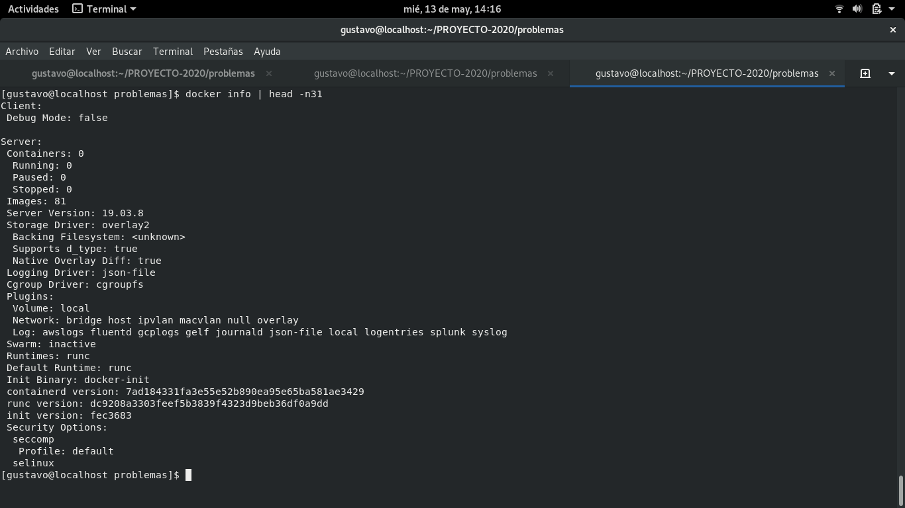
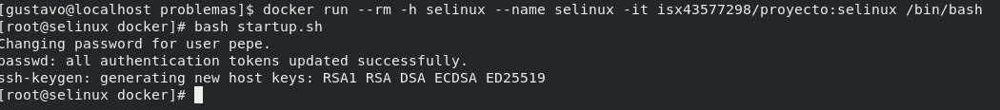
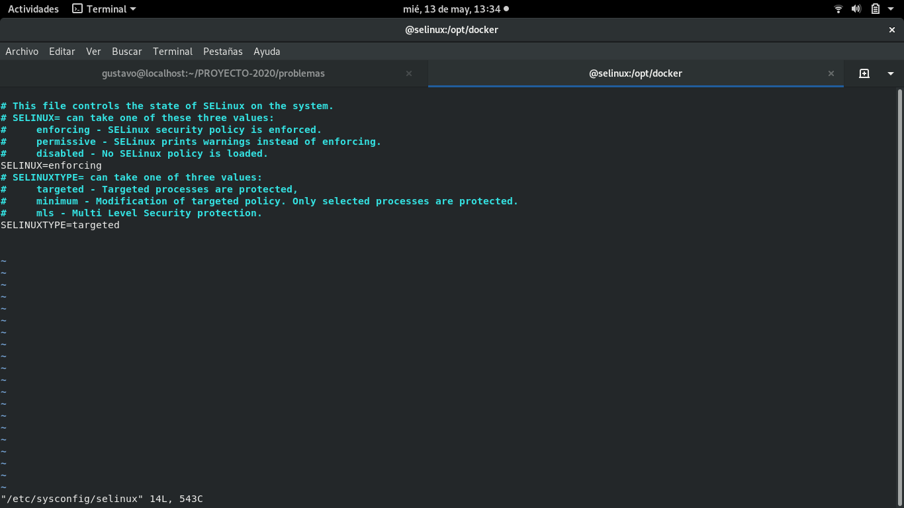
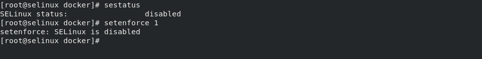
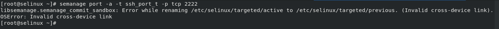

# Problemas

Documentación sobre los problemas o dificultades que he tenido a lo largo del desarrollo del proyecto

## Caso 1

Implementar SELinux en un docker con una imagen fedora:29. Docker utiliza sus propias reglas/políticas de SELinux y no es posible modificar/añadir una en el docker ni modificar el modo de operación en el que trabaja.

Cuando intento modificar una regla o su modo de operación salta el mensaje de que SELinux está en modo disabled, aunque el sistema de etiquetado de los objetos lo hace correctamente.

**1. Verificamos que docker tiene activado selinux en security options con la orden docker info**

**2. Entramos en docker con la imagen fedora:29 con los paquetes de SELinux instalados y el servicio sshd activo**

**3. Verificamos en que estado se encuentra SELinux mirando en el fichero /etc/sysconfig/selinux y por el comando getenforce. Intentamos cambiarlo a modo Enforcing y vemos que no nos lo permite**

**4. Intentamos modificar la política del puerto del servicio sshd y vemos que no nos lo permite**

**5. Verificamos que el etiquetado de los objetos se hace correctamente y que carga las políticas de SELinux**

